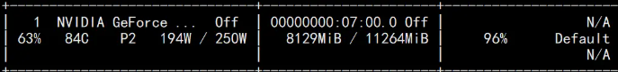

# 【关于 ChatGLM 微调】那些你不知道的事

## 一、介绍

本教程主要介绍对于 ChatGLM-6B 模型基于 [P-Tuning v2](https://github.com/THUDM/P-tuning-v2) 的微调。P-Tuning v2 将需要微调的参数量减少到原来的 0.1%，再通过模型量化、Gradient Checkpoint 等方法，最低只需要 7GB 显存即可运行。

本节 以 [ADGEN (广告生成)](https://aclanthology.org/D19-1321.pdf) 数据集为例介绍代码的使用方法。

硬件需求

| **量化等级**   | **最低 GPU 显存**（推理） | **最低 GPU 显存**（高效参数微调） |
| -------------- | ------------------------- | --------------------------------- |
| FP16（无量化） | 13 GB                     | 14 GB                             |
| INT8           | 8 GB                     | 9 GB                             |
| INT4           | 6 GB                      | 7 GB                              |

## 二、环境搭建

### 2.1 构建环境

```s
    $ conda create -n py310_chat python=3.10       # 创建新环境
    $ source activate py310_chat                   # 激活环境
```

### 2.2 下载代码

```s
    $ git clone https://github.com/THUDM/ChatGLM-6B.git
    $ cd ChatGLM-6B
```

### 2.3 安装依赖

运行微调需要4.27.1版本的transformers。除 ChatGLM-6B 的依赖之外，还需要按照以下依赖

```s
    $ pip install -r requirements.txt
    $ pip install rouge_chinese nltk jieba datasets
```

## 三、使用方法

### 3.1 训练数据下载

ADGEN 数据集任务为根据输入（content）生成一段广告词（summary）。

```s
{
    "content": "类型#上衣*版型#宽松*版型#显瘦*图案#线条*衣样式#衬衫*衣袖型#泡泡袖*衣款式#抽绳",
    "summary": "这件衬衫的款式非常的宽松，利落的线条可以很好的隐藏身材上的小缺点，穿在身上有着很好的显瘦效果。领口装饰了一个可爱的抽绳，漂亮的绳结展现出了十足的个性，配合时尚的泡泡袖型，尽显女性甜美可爱的气息。"
}
```
从 [Google Drive](https://drive.google.com/file/d/13_vf0xRTQsyneRKdD1bZIr93vBGOczrk/view?usp=sharing) 或者 [Tsinghua Cloud](https://cloud.tsinghua.edu.cn/f/b3f119a008264b1cabd1/?dl=1) 下载处理好的 ADGEN 数据集，将解压后的 ptuning/AdvertiseGen 目录放到本目录下。

### 3.2 模型下载

[Huggingface 平台](https://huggingface.co/THUDM)下载

```s
    $ git lfs install
    $ git clone https://huggingface.co/THUDM/chatglm-6b
```

### 3.3 模型训练

运行以下指令进行训练：

```s
    $ cd ptuning/
    $ bash train.sh
```

> 注 train.sh 脚本如下
```s
PRE_SEQ_LEN=8                      # soft prompt 长度
LR=1e-2                            # 训练的学习率

CUDA_VISIBLE_DEVICES=0 python main.py \
    --do_train \                                # 训练
    --train_file AdvertiseGen/train.json \      # 训练集地址
    --validation_file AdvertiseGen/dev.json \   # 验证集地址
    --prompt_column content \              # 训练集中prompt 的key名称【可以理解为输入值的key】
    --response_column summary \            # 训练集中response的key名称【可以理解为生成值的key】
    --overwrite_cache \                    # 是否覆盖 缓存
    --model_name_or_path THUDM/chatglm-6b \ # chatglm-6b 模型地址
    --output_dir output/adgen-chatglm-6b-pt-$PRE_SEQ_LEN-$LR \    # 模型保存地址
    --overwrite_output_dir \
    --max_source_length 64 \                
    --max_target_length 64 \
    --per_device_train_batch_size 1 \
    --per_device_eval_batch_size 1 \
    --gradient_accumulation_steps 16 \
    --predict_with_generate \
    --max_steps 3000 \
    --logging_steps 10 \
    --save_steps 1000 \
    --learning_rate $LR \
    --pre_seq_len $PRE_SEQ_LEN \
    --quantization_bit 4               # 模型 量化方式
```

train.sh 中的 PRE_SEQ_LEN 和 LR 分别是 soft prompt 长度和训练的学习率，可以进行调节以取得最佳的效果。P-Tuning-v2 方法会冻结全部的模型参数，可通过调整 quantization_bit 来被原始模型的量化等级，不加此选项则为 FP16 精度加载。

在默认配置 quantization_bit=4、per_device_train_batch_size=1、gradient_accumulation_steps=16 下，INT4 的模型参数被冻结，一次训练迭代会以 1 的批处理大小进行 16 次累加的前后向传播，等效为 16 的总批处理大小，此时最低只需 6.7G 显存。若想在同等批处理大小下提升训练效率，可在二者乘积不变的情况下，加大 per_device_train_batch_size 的值，但也会带来更多的显存消耗，请根据实际情况酌情调整。

**PRE_SEQ_LEN调整为512（2080ti使用情况如下）**：



### 3.4 模型推理

将 evaluate.sh 中的 CHECKPOINT 更改为训练时保存的 checkpoint 名称，运行以下指令进行模型推理和评测：

```s
    $ bash evaluate.sh
```

> 注 evaluate.sh 脚本如下
```s
PRE_SEQ_LEN=8
CHECKPOINT=adgen-chatglm-6b-pt-8-1e-2
STEP=3000

CUDA_VISIBLE_DEVICES=0 python3 main.py \
    --do_predict \
    --validation_file AdvertiseGen/dev.json \
    --test_file AdvertiseGen/dev.json \
    --overwrite_cache \
    --prompt_column content \
    --response_column summary \
    --model_name_or_path ./output/$CHECKPOINT/checkpoint-$STEP  \
    --output_dir ./output/$CHECKPOINT \
    --overwrite_output_dir \
    --max_source_length 64 \
    --max_target_length 64 \
    --per_device_eval_batch_size 1 \
    --predict_with_generate \
    --pre_seq_len $PRE_SEQ_LEN \
    --quantization_bit 4
```

### 3.5 生成结果分析

评测指标为中文 Rouge score 和 BLEU-4。生成的结果保存在 ./output/adgen-chatglm-6b-pt-8-1e-2/generated_predictions.txt。

- 示例1

```s
    Input: 类型#上衣*材质#牛仔布*颜色#白色*风格#简约*图案#刺绣*衣样式#外套*衣款式#破洞
    Label: 简约而不简单的牛仔外套,白色的衣身十分百搭。衣身多处有做旧破洞设计,打破单调乏味,增加一丝造型看点。衣身后背处有趣味刺绣装饰,丰富层次感,彰显别样时尚。
    Output[微调前]: 这件上衣的材质是牛仔布,颜色是白色,风格是简约,图案是刺绣,衣样式是外套,衣款式是破洞。
    Output[微调后]: 这是一款简约的牛仔外套,破洞设计,将牛仔布破洞,带来一种随意与个性。破洞的牛仔外套,展现出时尚气息,带来一种休闲感。同时,刺绣图案,让整件外套更加立体。
```

- 示例2

```s
    Input: 类型#裙*版型#显瘦*风格#文艺*风格#简约*图案#印花*图案#撞色*裙下摆#压褶*裙长#连衣裙*裙领型#圆领
    Label: 文艺个性的印花连衣裙,藏青色底蕴,低调又大气,撞色太阳花分布整个裙身,绚丽而美好,带来时尚减龄的气质。基础款的舒适圆领,简约不失大方,勾勒精致脸庞。领后是一粒包布扣固定,穿脱十分方便。前片立体的打褶设计,搭配后片压褶的做工,增添层次和空间感,显瘦又有型。
    Output[微调前]: 类型#裙版型#显瘦风格#文艺风格#简约图案#印花图案#撞色裙下摆#压褶裙长#连衣裙裙领型#圆领 1. 连衣裙:简约风格,裙长为膝盖以上,裙领型为圆领。2. 裙下摆:压褶设计,使裙摆呈现出流畅的褶皱效果。3. 裙领型:裙领型为圆领,使穿上连衣裙后更加有型。4. 版型:采用显瘦设计,让连衣裙看起来更加苗条。5. 风格:文艺风格,让连衣裙更加有内涵和品味。6. 图案:印花设计,在连衣裙上印有独特的图案。7. 撞色:采用撞色设计,让连衣裙在色彩上更加鲜明、富有层次感。
    Output[微调后]: 这是一款文艺范的连衣裙,以印花为元素,采用简约的印花,既能够突出文艺气质,又能够展现简约风。在印花的同时又有领子和裙摆的压褶设计,更加凸显文艺气质。简约而不会过于单调,搭配出街,穿着十分舒适。
```

### 3.6 模型部署

将对应的demo或代码中的THUDM/chatglm-6b换成经过 P-Tuning 微调之后 checkpoint 的地址（在示例中为 ./output/adgen-chatglm-6b-pt-8-1e-2/checkpoint-3000）。注意，目前的微调还不支持多轮数据，所以只有对话第一轮的回复是经过微调的。

## 四、友情链接

以下是部分基于本仓库开发的开源项目：

* [SwissArmyTransformer](https://github.com/THUDM/SwissArmyTransformer): 一个Transformer统一编程框架，ChatGLM-6B已经在SAT中进行实现并可以进行P-tuning微调。
* [ChatGLM-MNN](https://github.com/wangzhaode/ChatGLM-MNN): 一个基于 MNN 的 ChatGLM-6B C++ 推理实现，支持根据显存大小自动分配计算任务给 GPU 和 CPU
* [ChatGLM-Tuning](https://github.com/mymusise/ChatGLM-Tuning): 基于 LoRA 对 ChatGLM-6B 进行微调。类似的项目还包括 [Humanable ChatGLM/GPT Fine-tuning | ChatGLM 微调](https://github.com/hscspring/hcgf)
* [langchain-ChatGLM](https://github.com/imClumsyPanda/langchain-ChatGLM)：基于本地知识的 ChatGLM 应用，基于LangChain
* [bibliothecarius](https://github.com/coderabbit214/bibliothecarius)：快速构建服务以集成您的本地数据和AI模型，支持ChatGLM等本地化模型接入。
* [闻达](https://github.com/l15y/wenda)：大型语言模型调用平台，基于 ChatGLM-6B 实现了类 ChatPDF 功能
* [JittorLLMs](https://github.com/Jittor/JittorLLMs)：最低3G显存或者没有显卡都可运行 ChatGLM-6B FP16， 支持Linux、windows、Mac部署

以下是部分针对本项目的教程/文档：
* [Windows部署文档](https://github.com/ZhangErling/ChatGLM-6B/blob/main/deployment_windows.md)

## 五、to do

- ChatGLM-6b 特定任务微调实验：本章主要介绍的是 官方 提供的 ChatGLM-6b 在 [ADGEN (广告生成)](https://aclanthology.org/D19-1321.pdf) 数据集 上 进行微调；

## 参考

1. [THUDM/ChatGLM-6B](https://github.com/THUDM/ChatGLM-6B)
2. [P-Tuning v2](https://github.com/THUDM/P-tuning-v2) 
