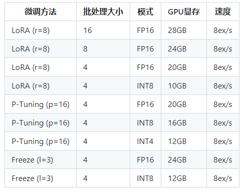

# 【LLMs 入门实战】基于 🤗PEFT 的高效 🤖ChatGLM2-6B 微调

> 参考：[hiyouga/ChatGLM-Efficient-Tuning](https://github.com/hiyouga/ChatGLM-Efficient-Tuning)

## 一、前言

本教程主要介绍对于 ChatGLM2-6B 模型基于 [PEFT](https://github.com/huggingface/peft) 的特定任务微调实验。

### 1.1 硬件需求


> 注：r 为LoRA 维数大小，p 为前缀词表大小，l 为微调层数，ex/s 为每秒训练的样本数。gradient_accumulation_steps 参数设置为 1。上述结果均来自于单个 Tesla V100 GPU，仅供参考。

### 1.2 微调方法

目前我们实现了针对以下高效微调方法的支持：

- [LoRA](https://arxiv.org/abs/2106.09685)：仅微调低秩适应器。
- [P-Tuning V2](https://github.com/THUDM/P-tuning-v2)：仅微调前缀编码器。
- [Freeze](https://arxiv.org/abs/2012.14913) ：仅微调后几层的全连接层。

### 1.3 软件依赖

- Python 3.8+, PyTorch 2.0.0
- 🤗Transformers, Datasets, Accelerate, TRL, PEFT（最低需要 0.3.0.dev0）
- protobuf, cpm_kernels, sentencepiece
- jieba, rouge_chinese, nltk（用于评估）
- gradio, mdtex2html（用于网页端交互）

## 二、环境搭建

### 2.1 构建环境

```s
    $ conda create -n py310_chat python=3.10       # 创建新环境
    $ source activate py310_chat                   # 激活环境
```

### 2.2 下载代码

```s
    $ git clone https://github.com/hiyouga/ChatGLM-Efficient-Tuning.git
    $ cd ChatGLM-Efficient-Tuning
```

### 2.3 安装依赖

```s
    $ pip install -r requirements.txt
```

## 三、资源准备

### 3.1 数据来源介绍

部分预置数据集简介：

| 数据集名称 | 规模 | 描述 |
| --- | --- | --- |
| [Stanford Alpaca](https://github.com/tatsu-lab/stanford_alpaca) | 52k | 斯坦福大学开源的 Alpaca 数据集，训练了 Alpaca 这类早期基于 LLaMA 的模型 |
| [Stanford Alpaca (Chinese)](https://github.com/ymcui/Chinese-LLaMA-Alpaca) | 51k | 使用 ChatGPT 翻译的 Alpaca 数据集 |
| [GPT-4 Generated Data](https://github.com/Instruction-Tuning-with-GPT-4/GPT-4-LLM) | 100k+ | 基于 GPT-4 的 self-instruction 数据集 |
| [BELLE 2M](https://huggingface.co/datasets/BelleGroup/train_2M_CN) | 2m | 包含约 200 万条由 [BELLE](https://github.com/LianjiaTech/BELLE) 项目生成的中文指令数据 |
| [BELLE 1M](https://huggingface.co/datasets/BelleGroup/train_1M_CN) | 1m | 包含约 100 万条由 [BELLE](https://github.com/LianjiaTech/BELLE) 项目生成的中文指令数据 |
| [BELLE 0.5M](https://huggingface.co/datasets/BelleGroup/train_0.5M_CN) | 500k  | 包含约 50 万条由 [BELLE](https://github.com/LianjiaTech/BELLE) 项目生成的中文指令数据 |
| [BELLE Dialogue 0.4M](https://huggingface.co/datasets/BelleGroup/generated_chat_0.4M) | 400k | 包含约 40 万条由 [BELLE](https://github.com/LianjiaTech/BELLE) 项目生成的个性化角色对话数据，包含角色介绍 |
| [BELLE School Math 0.25M](https://huggingface.co/datasets/BelleGroup/school_math_0.25M) | 250k  | 包含约 25 万条由 [BELLE](https://github.com/LianjiaTech/BELLE) 项目生成的中文数学题数据，包含解题过程 |
| [BELLE Multiturn Chat 0.8M](https://huggingface.co/datasets/BelleGroup/multiturn_chat_0.8M) | 800k | 包含约 80 万条由 [BELLE](https://github.com/LianjiaTech/BELLE) 项目生成的用户与助手的多轮对话 |
| [Guanaco Dataset](https://huggingface.co/datasets/JosephusCheung/GuanacoDataset) | 100k+ | 包含日文、简繁体中文、英文等多类数据，数据集原用于 Guanaco 模型训练 |
| [Firefly 1.1M](https://huggingface.co/datasets/YeungNLP/firefly-train-1.1M) | 1.1M  | 中文对话大模型 firefly（流萤）的中文数据集，包含多个 NLP 任务 |
| [CodeAlpaca 20k](https://huggingface.co/datasets/sahil2801/CodeAlpaca-20k) | 20k | 英文代码生成任务数据集 |
| [Alpaca CoT](https://huggingface.co/datasets/QingyiSi/Alpaca-CoT) | 6M | 用于微调的指令数据集集合 |
| [Web QA](https://huggingface.co/datasets/suolyer/webqa) | 36k | 百度知道汇集的中文问答数据集 |
| [UltraChat](https://github.com/thunlp/UltraChat) | 1.57M | 清华 NLP 发布的大规模多轮对话数据集 |

> 注：BELLE 数据集是由 ChatGPT 产生的数据集，不保证数据准确性，所有类 GPT 模型产生的 self-instruction 数据集均不能保证其准确性。

部分数据集的使用需要确认，我们推荐使用下述命令登录您的 HuggingFace 账户。

```s
    pip install --upgrade huggingface_hub
    huggingface-cli login
```

### 3.2 模型下载【建议下载到本地】

从 [Hugging Face Hub](https://huggingface.co/THUDM/chatglm2-6b/tree/main) 下载模型实现和参数 到本地，后期使用 只需要 从本地下载即可。

```s
    $ git lfs install
    $ git clone https://huggingface.co/THUDM/chatglm2-6b
```

## 四、ChatGLM2-6B 模型微调

### 4.1 ChatGLM2-6B 模型微调 数据集介绍

#### 4.1.1 alpaca_gpt4_zh 微调数据集介绍

```s
[
  {
    "instruction": "保持健康的三个提示。",
    "input": "",
    "output": "以下是保持健康的三个提示：\n\n1. 保持身体活动。每天做适当的身体运动，如散步、跑步或游泳，能促进心血管健康，增强肌肉力量，并有助于减少体重。\n\n2. 均衡饮食。每天食用新鲜的蔬菜、水果、全谷物和脂肪含量低的蛋白质食物，避免高糖、高脂肪和加工食品，以保持健康的饮食习惯。\n\n3. 睡眠充足。睡眠对人体健康至关重要，成年人每天应保证 7-8 小时的睡眠。良好的睡眠有助于减轻压力，促进身体恢复，并提高注意力和记忆力。"
  },
  {
    "instruction": "三原色是什么？",
    "input": "",
    "output": "三原色通常指的是红色、绿色和蓝色（RGB）。它们是通过加色混合原理创建色彩的三种基础颜色。在以发光为基础的显示设备中（如电视、计算机显示器、智能手机和平板电脑显示屏）, 三原色可混合产生大量色彩。其中红色和绿色可以混合生成黄色，红色和蓝色可以混合生成品红色，蓝色和绿色可以混合生成青色。当红色、绿色和蓝色按相等比例混合时，可以产生白色或灰色。\n\n此外，在印刷和绘画中，三原色指的是以颜料为基础的红、黄和蓝颜色（RYB）。这三种颜色用以通过减色混合原理来创建色彩。不过，三原色的具体定义并不唯一，不同的颜色系统可能会采用不同的三原色。"
  },
  ...
]
```

### 4.2 ChatGLM2-6B 模型微调

#### 4.2.1 ChatGLM2-6B 模型 单 GPU 微调训练

ChatGLM2-6B 模型的微调。需要使用--use_v2 参数来进行训练。

运行以下指令进行微调：

- freeze 方式 微调

```s
    $ CUDA_VISIBLE_DEVICES=0 python ../src/train_sft.py \
    --do_train \
    --dataset alpaca_gpt4_zh \
    --dataset_dir ../data \
    --finetuning_type freeze \
    --output_dir path_to_sft_checkpoint \
    --overwrite_cache \
    --per_device_train_batch_size 1 \
    --gradient_accumulation_steps 1 \
    --lr_scheduler_type cosine \
    --logging_steps 10 \
    --save_steps 1000 \
    --learning_rate 5e-5 \
    --num_train_epochs 3.0 \
    --plot_loss \
    --fp16 \
    --use_v2        
```

- p_tuning 方式 微调

```s
    $ CUDA_VISIBLE_DEVICES=0 python ../src/train_sft.py \
    --do_train \
    --dataset alpaca_gpt4_zh \
    --dataset_dir ../data \
    --finetuning_type p_tuning \
    --output_dir path_to_sft_checkpoint \
    --overwrite_cache \
    --per_device_train_batch_size 1 \
    --gradient_accumulation_steps 1 \
    --lr_scheduler_type cosine \
    --logging_steps 10 \
    --save_steps 1000 \
    --learning_rate 5e-5 \
    --num_train_epochs 3.0 \
    --plot_loss \
    --use_v2         
```

> output
```s
    ...
    100%|█████████████████████████| 146454/146454 [7:51:57<00:00,  4.03it/s][INFO|trainer.py:2053] 2023-07-01 09:22:53,773 >> 

  Training completed. Do not forget to share your model on huggingface.co/models =)


  {'train_runtime': 28324.7089, 'train_samples_per_second': 5.171, 'train_steps_per_second': 5.171, 'train_loss': 0.177752665720254, 'epoch': 3.0}
  100%|█████████████████████████| 146454/146454 [7:51:57<00:00,  5.17it/s]
  ***** train metrics *****
    epoch                    =        3.0
    train_loss               =     0.1778
    train_runtime            = 7:52:04.70
    train_samples_per_second =      5.171
    train_steps_per_second   =      5.171
  07/01/2023 09:22:53 - INFO - utils.peft_trainer - Saving model checkpoint to path_to_sft_checkpoint
  [INFO|configuration_utils.py:458] 2023-07-01 09:22:53,897 >> Configuration saved in path_to_sft_checkpoint/config.json
  [INFO|configuration_utils.py:364] 2023-07-01 09:22:53,897 >> Configuration saved in path_to_sft_checkpoint/generation_config.json
  [INFO|modeling_utils.py:1853] 2023-07-01 09:22:53,898 >> Model weights saved in path_to_sft_checkpoint/pytorch_model.bin
  [INFO|tokenization_utils_base.py:2194] 2023-07-01 09:22:53,898 >> tokenizer config file saved in path_to_sft_checkpoint/tokenizer_config.json
  [INFO|tokenization_utils_base.py:2201] 2023-07-01 09:22:53,898 >> Special tokens file saved in path_to_sft_checkpoint/special_tokens_map.json
  Figure saved: path_to_sft_checkpoint/training_loss.png
  07/01/2023 09:43:24 - WARNING - utils.other - No metric eval_loss to plot.

  wandb: Waiting for W&B process to finish... (success).
  wandb:                                                                                
  wandb: 
  wandb: Run history:
  wandb:                    train/epoch ▁▁▁▁▂▂▂▂▂▃▃▃▃▃▃▄▄▄▄▄▅▅▅▅▅▅▆▆▆▆▆▇▇▇▇▇▇███
  wandb:              train/global_step ▁▁▁▁▂▂▂▂▂▃▃▃▃▃▃▄▄▄▄▄▅▅▅▅▅▅▆▆▆▆▆▇▇▇▇▇▇███
  wandb:            train/learning_rate ███████▇▇▇▇▇▇▆▆▆▅▅▅▅▄▄▄▄▃▃▃▃▂▂▂▂▂▁▁▁▁▁▁▁
  wandb:                     train/loss █▆▃▂▁▁▁▁▁▁▁▁▁▁▁▁▁▁▁▁▁▁▁▁▁▁▁▁▁▁▁▁▁▁▁▁▁▁▁▁
  wandb:               train/total_flos ▁
  wandb:               train/train_loss ▁
  wandb:            train/train_runtime ▁
  wandb: train/train_samples_per_second ▁
  wandb:   train/train_steps_per_second ▁
  wandb: 
  wandb: Run summary:
  wandb:                    train/epoch 3.0
  wandb:              train/global_step 146454
  wandb:            train/learning_rate 0.0
  wandb:                     train/loss 0.0086
  wandb:               train/total_flos 8.419979127255368e+17
  wandb:               train/train_loss 0.17775
  wandb:            train/train_runtime 28324.7089
  wandb: train/train_samples_per_second 5.171
  wandb:   train/train_steps_per_second 5.171
  wandb: 
  wandb: Synced wise-durian-50: https://wandb.ai/13025232601/huggingface/runs/202g1fjg
  wandb: Synced 6 W&B file(s), 0 media file(s), 0 artifact file(s) and 0 other file(s)
  wandb: Find logs at: ./wandb/run-20230701_013050-202g1fjg/logs


```

- lora 方式 微调

```s
    $ CUDA_VISIBLE_DEVICES=0 python ../src/train_sft.py \
    --do_train \
    --dataset alpaca_gpt4_zh \
    --dataset_dir ../data \
    --finetuning_type lora \
    --output_dir path_to_sft_checkpoint \
    --overwrite_cache \
    --per_device_train_batch_size 1 \
    --gradient_accumulation_steps 1 \
    --lr_scheduler_type cosine \
    --logging_steps 10 \
    --save_steps 1000 \
    --learning_rate 5e-5 \
    --num_train_epochs 3.0 \
    --plot_loss \
    --fp16 \
    --use_v2        
```

> output
```s
...
100%|█████████████████████████| 146454/146454 [8:39:27<00:00,  3.44it/s]{'train_runtime': 31174.0434, 'train_samples_per_second': 4.698, 'train_steps_per_second': 4.698, 'train_loss': 1.6946858559184583, 'epoch': 3.0}
100%|█████████████████████████| 146454/146454 [8:39:27<00:00,  4.70it/s]
***** train metrics *****
  epoch                    =        3.0
  train_loss               =     1.6947
  train_runtime            = 8:39:34.04
  train_samples_per_second =      4.698
  train_steps_per_second   =      4.698
07/01/2023 00:22:01 - INFO - utils.peft_trainer - Saving model checkpoint to path_to_sft_checkpoint
Figure saved: path_to_sft_checkpoint/training_loss.png
07/01/2023 01:11:13 - WARNING - utils.other - No metric eval_loss to plot.

wandb: Waiting for W&B process to finish... (success).
wandb:                                                                                
wandb: 
wandb: Run history:
wandb:                    train/epoch ▁▁▁▁▂▂▂▂▂▃▃▃▃▃▃▄▄▄▄▄▅▅▅▅▅▅▆▆▆▆▆▇▇▇▇▇▇███
wandb:              train/global_step ▁▁▁▁▂▂▂▂▂▃▃▃▃▃▃▄▄▄▄▄▅▅▅▅▅▅▆▆▆▆▆▇▇▇▇▇▇███
wandb:            train/learning_rate ███████▇▇▇▇▇▇▆▆▆▅▅▅▅▄▄▄▄▃▃▃▃▂▂▂▂▂▁▁▁▁▁▁▁
wandb:                     train/loss ▅▅▄▄▆▃▃▃▆▄▅▆▃▃▁▂▁▂▂▅▂▅▇▂▅▃█▅▆▃▇▂▂▃▅▄▅▂▃▆
wandb:               train/total_flos ▁
wandb:               train/train_loss ▁
wandb:            train/train_runtime ▁
wandb: train/train_samples_per_second ▁
wandb:   train/train_steps_per_second ▁
wandb: 
wandb: Run summary:
wandb:                    train/epoch 3.0
wandb:              train/global_step 146454
wandb:            train/learning_rate 0.0
wandb:                     train/loss 1.4363
wandb:               train/total_flos 8.422725609575055e+17
wandb:               train/train_loss 1.69469
wandb:            train/train_runtime 31174.0434
wandb: train/train_samples_per_second 4.698
wandb:   train/train_steps_per_second 4.698
```

#### 4.2.2 ChatGLM2-6B 模型 多 GPU 分布式微调

1. 配置 分布式环境

```s
    $ accelerate config # 首先配置分布式环境
```

> 注：注意：若您使用 LoRA 方法进行微调，请指定以下参数 --ddp_find_unused_parameters False 来避免报错。

2. 运行以下指令进行微调：

> lora 方式 微调
```s
    $ accelerate launch src/train_sft.py # 参数同上
```

## 五、ChatGLM2-6B 评估预测

### 5.1 ChatGLM2-6B 指标评估（BLEU分数和汉语ROUGE分数）

```s
CUDA_VISIBLE_DEVICES=0 python src/finetune.py \
    --do_eval \
    --dataset alpaca_gpt4_zh \
    --checkpoint_dir path_to_checkpoint \
    --output_dir path_to_eval_result \
    --per_device_eval_batch_size 8 \
    --max_samples 50 \
    --predict_with_generate
```

> output
```s
===================================BUG REPORT===================================
Welcome to bitsandbytes. For bug reports, please submit your error trace to: https://github.com/TimDettmers/bitsandbytes/issues
================================================================================
...
mon - Training/evaluation parameters Seq2SeqTrainingArguments(
_n_gpu=1,
adafactor=False,
adam_beta1=0.9,
adam_beta2=0.999,
adam_epsilon=1e-08,
auto_find_batch_size=False,
bf16=False,
bf16_full_eval=False,
data_seed=None,
dataloader_drop_last=False,
dataloader_num_workers=0,
dataloader_pin_memory=True,
ddp_bucket_cap_mb=None,
ddp_find_unused_parameters=None,
ddp_timeout=1800,
debug=[],
deepspeed=None,
disable_tqdm=False,
do_eval=True,
do_predict=False,
do_train=False,
eval_accumulation_steps=None,
eval_delay=0,
eval_steps=None,
evaluation_strategy=no,
fp16=False,
fp16_backend=auto,
fp16_full_eval=False,
fp16_opt_level=O1,
fsdp=[],
fsdp_config={'fsdp_min_num_params': 0, 'xla': False, 'xla_fsdp_grad_ckpt': False},
fsdp_min_num_params=0,
fsdp_transformer_layer_cls_to_wrap=None,
full_determinism=False,
generation_config=None,
generation_max_length=None,
generation_num_beams=None,
gradient_accumulation_steps=1,
gradient_checkpointing=False,
greater_is_better=None,
group_by_length=False,
half_precision_backend=auto,
hub_model_id=None,
hub_private_repo=False,
hub_strategy=every_save,
hub_token=<HUB_TOKEN>,
ignore_data_skip=False,
include_inputs_for_metrics=False,
jit_mode_eval=False,
label_names=None,
label_smoothing_factor=0.0,
learning_rate=5e-05,
length_column_name=length,
load_best_model_at_end=False,
local_rank=-1,
log_level=passive,
log_level_replica=warning,
log_on_each_node=True,
logging_dir=path_to_eval_result/runs/May05_00-58-16_tgnet,
logging_first_step=False,
logging_nan_inf_filter=True,
logging_steps=500,
logging_strategy=steps,
lr_scheduler_type=linear,
max_grad_norm=1.0,
max_steps=-1,
metric_for_best_model=None,
mp_parameters=,
no_cuda=False,
num_train_epochs=3.0,
optim=adamw_torch,
optim_args=None,
output_dir=path_to_eval_result,
overwrite_output_dir=False,
past_index=-1,
per_device_eval_batch_size=1,
per_device_train_batch_size=8,
predict_with_generate=True,
prediction_loss_only=False,
push_to_hub=False,
push_to_hub_model_id=None,
push_to_hub_organization=None,
push_to_hub_token=<PUSH_TO_HUB_TOKEN>,
ray_scope=last,
remove_unused_columns=True,
report_to=['tensorboard', 'wandb'],
resume_from_checkpoint=None,
run_name=path_to_eval_result,
save_on_each_node=False,
save_safetensors=False,
save_steps=500,
save_strategy=steps,
save_total_limit=None,
seed=42,
sharded_ddp=[],
skip_memory_metrics=True,
sortish_sampler=False,
tf32=None,
torch_compile=False,
torch_compile_backend=None,
torch_compile_mode=None,
torchdynamo=None,
tpu_metrics_debug=False,
tpu_num_cores=None,
use_ipex=False,
use_legacy_prediction_loop=False,
use_mps_device=False,
warmup_ratio=0.0,
warmup_steps=0,
weight_decay=0.0,
xpu_backend=None,
)
...
[INFO|configuration_utils.py:720] 2023-05-05 00:58:18,251 >> Model config ChatGLMConfig {
  "_name_or_path": "THUDM/ChatGLM2-6B",
  "architectures": [
    "ChatGLMModel"
  ],
  "auto_map": {
    "AutoConfig": "configuration_chatglm.ChatGLMConfig",
    "AutoModel": "modeling_chatglm.ChatGLMForConditionalGeneration",
    "AutoModelForSeq2SeqLM": "modeling_chatglm.ChatGLMForConditionalGeneration"
  },
  "bos_token_id": 130004,
  "eos_token_id": 130005,
  "gmask_token_id": 130001,
  "hidden_size": 4096,
  "inner_hidden_size": 16384,
  "layernorm_epsilon": 1e-05,
  "mask_token_id": 130000,
  "max_sequence_length": 2048,
  "model_type": "chatglm",
  "num_attention_heads": 32,
  "num_layers": 28,
  "pad_token_id": 3,
  "position_encoding_2d": true,
  "pre_seq_len": null,
  "prefix_projection": false,
  "quantization_bit": 0,
  "torch_dtype": "float16",
  "transformers_version": "4.28.1",
  "use_cache": true,
  "vocab_size": 130528
}
[INFO|configuration_utils.py:575] 2023-05-05 00:58:18,291 >> Generate config GenerationConfig {
  "_from_model_config": true,
  "bos_token_id": 130004,
  "eos_token_id": 130005,
  "pad_token_id": 3,
  "transformers_version": "4.28.1"
}

Loading checkpoint shards: 100%|████████████████████████████████████████████████████| 8/8 [00:10<00:00,  1.30s/it]
...
[INFO|modeling_utils.py:2839] 2023-05-05 00:58:29,280 >> Generation config file not found, using a generation config created from the model config.
05/05/2023 00:59:18 - INFO - utils.common - Quantized model to 4 bit.
05/05/2023 00:59:18 - INFO - utils.common - Fine-tuning method: P-Tuning V2
trainable params: 3670016 || all params: 3359416320 || trainable%: 0.1092
05/05/2023 00:59:18 - WARNING - datasets.arrow_dataset - Loading cached processed dataset at /.cache/huggingface/datasets/json/default-5c75ee3f92a08afd/0.0.0/fe5dd6ea2639a6df622901539cb550cf8797e5a6b2dd7af1cf934bed8e233e6e/cache-a21964d2ca8fe3cd.arrow
input_ids:
[3, 3, 3, 3, 3, 3, 3, 3, 3, 3, 3, 3, 3, 3, 3, 3, 3, 3, 3, 3, 3, 3, 3, 3, 3, 3, 3, 3, 3, 3, 3, 3, 3, 3, 3, 5, 112991, 80990, 66334, 63823, 130001, 130004]
inputs:
保持健康的三个提示。
label_ids:
[82235, 112991, 80990, 66334, 12, 4, 4, 9, 7, 5, 64442, 64310, 63987, 63823, 64354, 63912, 70666, 64310, 64287, 6, 63906, 71738, 63824, 70153, 63853, 68483, 6, 83231, 83242, 64176, 6, 65337, 66448, 65006, 6, 63885, 67623, 64651, 67266, 63823, 4, 4, 10, 7, 5, 71356, 65821, 63823, 64354, 65979, 73362, 66296, 63824, 66220, 63824, 64080, 89181, 63826, 100913, 64284, 94211, 65091, 6, 65073, 63905, 65044, 63824, 105241, 63826, 65521, 65060, 6, 63847, 112991, 108006, 63823, 4, 4, 13, 7, 5, 66625, 69769, 63823, 66625, 118143, 76038, 6, 73929, 64354, 64064, 64849, 5, 25, 11, 23, 5, 88081, 66625, 63823, 66584, 66625, 67623, 67455, 64700, 6, 64721, 64310, 65181, 6, 63885, 64299, 73066, 63826, 75991, 63823, 130001, 130004]
labels:
以下是保持健康的三个提示:

1. 保持身体活动。每天做适当的身体运动,如散步、跑步或游泳,能促进心血管健康,增强肌肉力量,并有助于减少体重。

2. 均衡饮食。每天食用新鲜的蔬菜、水果、全谷物和脂肪含量低的蛋白质食物,避免高糖、高脂肪和加工食品,以保持健康的饮食习惯。

3. 睡眠充足。睡眠对人体健康至关重要,成年人每天应保证 7-8 小时的睡眠。良好的睡眠有助于减轻压力,促进身体恢复,并提高注意力和记忆力。
[INFO|trainer.py:3129] 2023-05-05 00:59:19,444 >> ***** Running Evaluation *****
[INFO|trainer.py:3131] 2023-05-05 00:59:19,444 >>   Num examples = 50
[INFO|trainer.py:3134] 2023-05-05 00:59:19,444 >>   Batch size = 1
[INFO|configuration_utils.py:575] 2023-05-05 00:59:19,449 >> Generate config GenerationConfig {
  "_from_model_config": true,
  "bos_token_id": 130004,
  "eos_token_id": 130005,
  "pad_token_id": 3,
  "transformers_version": "4.28.1"
}

100%|█████████████████████████████████████████████████████████████████████████████| 50/50 ...
100%|█████████████████████████████████████████████████████████████████████████████| 50/50 [07:41<00:00,  9.24s/it]
***** eval metrics *****
  eval_bleu-4             =    13.0515
  eval_rouge-1            =    33.0999
  eval_rouge-2            =    13.6305
  eval_rouge-l            =    24.3066
  eval_runtime            = 0:07:43.40
  eval_samples_per_second =      0.108
  eval_steps_per_second   =      0.108

wandb: Waiting for W&B process to finish... (success).
wandb:                                                                                
wandb: 
wandb: Run history:
wandb:             eval/bleu-4 ▁
wandb:            eval/rouge-1 ▁
wandb:            eval/rouge-2 ▁
wandb:            eval/rouge-l ▁
wandb:            eval/runtime ▁
wandb: eval/samples_per_second ▁
wandb:   eval/steps_per_second ▁
wandb:       train/global_step ▁
wandb: 
wandb: Run summary:
wandb:             eval/bleu-4 13.05145
wandb:            eval/rouge-1 33.09988
wandb:            eval/rouge-2 13.63049
wandb:            eval/rouge-l 24.30655
wandb:            eval/runtime 463.4072
wandb: eval/samples_per_second 0.108
wandb:   eval/steps_per_second 0.108
wandb:       train/global_step 0
wandb: 
wandb: Synced imperial-council-44: https://wandb.ai/13025232601/huggingface/runs/37i3uo74
wandb: Synced 6 W&B file(s), 0 media file(s), 0 artifact file(s) and 0 other file(s)
wandb: Find logs at: ./wandb/run-20230505_010703-37i3uo74/logs
```

### 5.2 ChatGLM2-6B 模型预测

```s
  CUDA_VISIBLE_DEVICES=0 python src/finetune.py \
    --do_predict \
    --dataset alpaca_gpt4_zh \
    --checkpoint_dir path_to_checkpoint \
    --output_dir path_to_predict_result \
    --per_device_eval_batch_size 8 \
    --max_samples 50 \
    --predict_with_generate
```

> output
```s
...
input_ids:
[3, 3, 3, 3, 3, 3, 3, 3, 3, 3, 3, 3, 3, 3, 3, 3, 3, 3, 3, 3, 3, 3, 3, 3, 3, 3, 3, 3, 3, 3, 3, 3, 3, 3, 3, 5, 112991, 80990, 66334, 63823, 130001, 130004]
inputs:
保持健康的三个提示。
label_ids:
[82235, 112991, 80990, 66334, 12, 4, 4, 9, 7, 5, 64442, 64310, 63987, 63823, 64354, 63912, 70666, 64310, 64287, 6, 63906, 71738, 63824, 70153, 63853, 68483, 6, 83231, 83242, 64176, 6, 65337, 66448, 65006, 6, 63885, 67623, 64651, 67266, 63823, 4, 4, 10, 7, 5, 71356, 65821, 63823, 64354, 65979, 73362, 66296, 63824, 66220, 63824, 64080, 89181, 63826, 100913, 64284, 94211, 65091, 6, 65073, 63905, 65044, 63824, 105241, 63826, 65521, 65060, 6, 63847, 112991, 108006, 63823, 4, 4, 13, 7, 5, 66625, 69769, 63823, 66625, 118143, 76038, 6, 73929, 64354, 64064, 64849, 5, 25, 11, 23, 5, 88081, 66625, 63823, 66584, 66625, 67623, 67455, 64700, 6, 64721, 64310, 65181, 6, 63885, 64299, 73066, 63826, 75991, 63823, 130001, 130004]
labels:
以下是保持健康的三个提示:

1. 保持身体活动。每天做适当的身体运动,如散步、跑步或游泳,能促进心血管健康,增强肌肉力量,并有助于减少体重。

2. 均衡饮食。每天食用新鲜的蔬菜、水果、全谷物和脂肪含量低的蛋白质食物,避免高糖、高脂肪和加工食品,以保持健康的饮食习惯。

3. 睡眠充足。睡眠对人体健康至关重要,成年人每天应保证 7-8 小时的睡眠。良好的睡眠有助于减轻压力,促进身体恢复,并提高注意力和记忆力。
[INFO|trainer.py:3129] 2023-05-05 04:42:02,531 >> ***** Running Prediction *****
[INFO|trainer.py:3131] 2023-05-05 04:42:02,531 >>   Num examples = 50
[INFO|trainer.py:3134] 2023-05-05 04:42:02,531 >>   Batch size = 8
[INFO|configuration_utils.py:575] 2023-05-05 04:42:02,539 >> Generate config GenerationConfig {
  "_from_model_config": true,
  "bos_token_id": 130004,
  "eos_token_id": 130005,
  "pad_token_id": 3,
  "transformers_version": "4.28.1"
}

100%|████████████████████████████████████████████████████████████████████████████████| 7/7 [02:07<00:00, 19.63s/it]Building prefix dict from the default dictionary ...
05/05/2023 04:44:34 - DEBUG - jieba - Building prefix dict from the default dictionary ...
Loading model from cache /tmp/jieba.cache
05/05/2023 04:44:34 - DEBUG - jieba - Loading model from cache /tmp/jieba.cache
Loading model cost 0.221 seconds.
05/05/2023 04:44:34 - DEBUG - jieba - Loading model cost 0.221 seconds.
Prefix dict has been built successfully.
05/05/2023 04:44:34 - DEBUG - jieba - Prefix dict has been built successfully.
100%|████████████████████████████████████████████████████████████████████████████████| 7/7 [02:07<00:00, 18.26s/it]
***** predict metrics *****
  predict_bleu-4             =    11.0719
  predict_rouge-1            =    31.7603
  predict_rouge-2            =    12.2967
  predict_rouge-l            =    23.4435
  predict_runtime            = 0:02:32.01
  predict_samples_per_second =      0.329
  predict_steps_per_second   =      0.046
05/05/2023 04:44:34 - INFO - utils.seq2seq - Saving prediction results to path_to_predict_result/generated_predictions.txt

```

### 5.3 ChatGLM2-6B 模型推理

```s
  CUDA_VISIBLE_DEVICES=0 python src/infer.py  --checkpoint_dir path_to_checkpoint --quantization_bit=4
```

> 对话一
```s
User: 政府可以采取哪些策略来减少空气污染？

ChatGLM2-6B: 政府可以采取以下策略来减少空气污染：

1. 推广清洁能源：政府可以通过推广太阳能、风能、水能等清洁能源来减少空气污染。政府还可以鼓励人们使用电动汽车、混合动力汽车、节能灯具等环保产品。
2. 改善交通方式：政府可以改善交通方式，如减少汽车尾气排放，提高公共交通的使用效率，改善道路的通行条件等。
3. 控制工业污染：政府可以通过改善工业污染治理、加强环境监测来减少工业污染。
4. 加强环境教育：政府可以通过加强环境教育，提高公众的环境意识和环保意识，鼓励人们采取环保行动。
5. 实施环境法规：政府可以通过制定和执行环境法规，加强环境监管，打击环境违法行为，保证环境的可持续发展。

政府可以通过以上多种策略来减少空气污染，为人们创造更加健康、舒适的环境。
```

> 对话二
```s
User: 自主机器人是计算机控制的机器，被编程执行特定任务而不需要任何人类输入。自主机器人在各个行业中被越来越广泛地应用，从制造业到医疗保健再到安全。

ChatGLM2-6B: 自主机器人是指计算机控制的机器，被编程执行特定任务而不需要任何人类输入。这种技术在各个行业中都得到了越来越广泛的应用，从制造业到医疗保健再到安全。

在制造业中，自主机器人可以执行重复性任务，如装配线、包装、物流等。它们可以提高生产效率和质量，减少人工操作，提高安全性和可靠性。
在医疗保健领域，自主机器人可以执行手术、治疗、护理等任务。它们可以提高医疗效率和准确性，减少手术风险和错误。
在安全领域，自主机器人可以执行巡逻、监控、救援等任务。它们可以提高安全性和可靠性，减少人为错误和失误。
自主机器人技术在各个行业都有很多应用，可以提高生产效率、质量和安全性。随着技术的发展，自主机器人也会变得更加智能和人性化，成为人类的伙伴。
```

### 5.4 ChatGLM2-6B 浏览器测试

```s
  CUDA_VISIBLE_DEVICES=0 python src/web_demo.py \
    --checkpoint_dir path_to_checkpoint
```

## 六、踩坑笔记

### 6.1 第三步出现错误：RuntimeError: probability tensor contains either inf, nan or element < 0

- 问题描述

```s
  ...
  next_tokens = torch.multinomial(probs, num_samples=1).squeeze(1)
  RuntimeError: probability tensor contains either inf, nan or element < 0
```

- 解决方法: 将 model.generate 中  设置 do_sample=False 

### 6.2 微调显存问题

- 问题描述：在 执行 微调命令时，爆 显存不足
- 解决方法：在 train_sft.sh 中 添加 参数 --quantization_bit=8，该命令的作用时 进行 8bit 量化

### 6.3 使用 freeze 进行 量化微调时出错

- 问题描述：使用 freeze 进行 量化微调时出错
- 问题原因：freeze微调训练，不能进行 量化操作
- 解决方法：删除 --quantization_bit=8 即可

### 6.4 使用  P-Tuning v2 进行 微调时  AssertionError: Please disable fp16 training while using the P-Tuning v2 method.

- 问题描述：使用 freeze 进行 量化微调时出错

```s
  $ AssertionError: Please disable fp16 training while using the P-Tuning v2 method.
```

- 问题原因：P-Tuning v2 微调 不支持 fp16
- 解决方法：删除 --fp16 即可

## 参考/感谢

1. [THUDM/ChatGLM2-6B](https://github.com/THUDM/ChatGLM2-6B)
2. [hiyouga/ChatGLM-Efficient-Tuning](https://github.com/hiyouga/ChatGLM-Efficient-Tuning)
