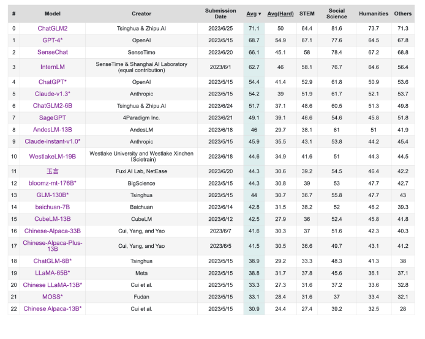
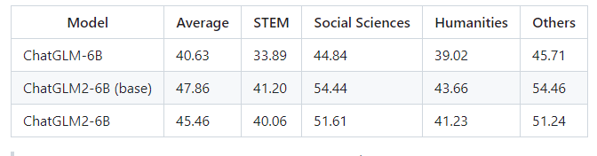
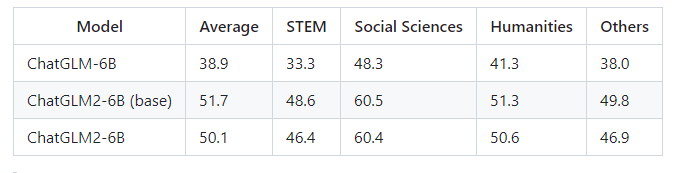
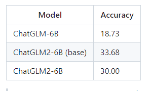

# 【LLMs 入门实战】 ChatGLM2-6B 模型学习与实战
 
- 论文名称：ChatGLM2-6B: An Open Bilingual Chat LLM | 开源双语对话语言模型
- 论文地址：
- Github 代码：https://github.com/THUDM/ChatGLM2-6B

## 一、前言

### 1.1 动机

在主要评估LLM模型中文能力的 C-Eval 榜单中，截至6月25日 ChatGLM2 模型以 71.1 的分数位居 Rank 0 ，ChatGLM2-6B 模型以 51.7 的分数位居 Rank 6，是榜单上排名最高的开源模型。



CEval榜单，ChatGLM2暂时位居Rank 0，ChatGLM2-6B位居 Rank 6

### 1.2 软件资源

- CUDA 11.7
- Python 3.10
- pytorch 1.13.1+cu117

### 1.3 ChatGLM2-6B 性能升级

ChatGLM2-6B 是开源中英双语对话模型 ChatGLM-6B 的第二代版本，在保留了初代模型对话流畅、部署门槛较低等众多优秀特性的基础之上，ChatGLM2-6B 引入了如下新特性：

- **更强大的性能**：基于 ChatGLM 初代模型的开发经验，我们全面升级了 ChatGLM2-6B 的基座模型。ChatGLM2-6B 使用了 GLM 的混合目标函数，经过了 1.4T 中英标识符的预训练与人类偏好对齐训练，评测结果显示，相比于初代模型，ChatGLM2-6B 在 MMLU（+23%）、CEval（+33%）、GSM8K（+571%） 、BBH（+60%）等数据集上的性能取得了大幅度的提升，在同尺寸开源模型中具有较强的竞争力。
- **更长的上下文**：基于 FlashAttention 技术，我们将基座模型的上下文长度（Context Length）由 ChatGLM-6B 的 2K 扩展到了 32K，并在对话阶段使用 8K 的上下文长度训练，允许更多轮次的对话。但当前版本的 ChatGLM2-6B 对单轮超长文档的理解能力有限，我们会在后续迭代升级中着重进行优化。
- **更高效的推理**：基于 Multi-Query Attention 技术，ChatGLM2-6B 有更高效的推理速度和更低的显存占用：在官方的模型实现下，推理速度相比初代提升了 42%，INT4 量化下，6G 显存支持的对话长度由 1K 提升到了 8K。
- **更开放的协议**：ChatGLM2-6B 权重对学术研究完全开放，在获得官方的书面许可后，亦允许商业使用。如果您发现我们的开源模型对您的业务有用，我们欢迎您对下一代模型 ChatGLM3 研发的捐赠。

## 二、环境搭建

### 2.1 下载代码 

```s
    $ git clone https://github.com/THUDM/ChatGLM2-6B
```

### 2.2 构建环境

```s
    $ conda create -n py310_chat python=3.10       # 创建新环境
    $ source activate py310_chat                   # 激活环境
```

### 2.3 安装依赖 

```s
    $ cd ChatGLM2-6B
    $ pip install -r requirements.txt -i https://pypi.tuna.tsinghua.edu.cn/simple
```

### 2.4 安装 lfs 方便本地下载 ChatGLM2-6B 大模型

从 [Hugging Face Hub](https://huggingface.co/THUDM/chatglm2-6b/tree/main) 下载模型实现和参数 到本地，后期使用 只需要 从本地下载即可。

```s
    $ git lfs install
    $ git clone https://huggingface.co/THUDM/chatglm2-6b
```

> 注：模型的实现仍然处在变动中。如果希望固定使用的模型实现以保证兼容性，可以在 from_pretrained 的调用中增加 revision="v1.0" 参数。v1.0 是当前最新的版本号，完整的版本列表参见 Change Log。

## 三、模型推理

可以通过如下代码调用 ChatGLM2-6B 模型来生成对话：

```s
from transformers import AutoTokenizer, AutoModel
tokenizer = AutoTokenizer.from_pretrained("/data/chat/chatglm2-6b", trust_remote_code=True)
model = AutoModel.from_pretrained("/data/chat/chatglm2-6b", trust_remote_code=True, device='cuda')
model = model.eval()
response, history = model.chat(tokenizer, "你好", history=[])
print(response)
>>>
你好👋！我是人工智能助手 ChatGLM2-6B，很高兴见到你，欢迎问我任何问题。
```
    
```s
response, history = model.chat(tokenizer, "晚上睡不着应该怎么办", history=history)
print(response)
>>>
如果你晚上睡不着，可以尝试以下一些方法来帮助你入睡：

1. 改善睡眠环境：确保睡眠环境安静、舒适、黑暗、凉爽。
2. 放松身心：使用放松技巧，如冥想、温水泡脚、按摩等。
3. 规律作息：保持规律的作息时间，每天按时上床睡觉和起床。
4. 避免刺激：避免在睡觉前看电子屏幕、吃较重的食物、喝咖啡或饮料，以免刺激身体和大脑。
5. 远离压力：避免在睡觉前进行紧张的活动，如激烈的运动或紧张的工作。
6. 适度锻炼：适量的锻炼可以帮助身体放松，有助于睡眠。
7. 心理治疗：如果你有焦虑或抑郁等问题，可以考虑接受心理治疗。

如果这些方法不能解决你的问题，可以尝试寻求医生或专业人士的帮助。
```

## 四、网页版 模型推理

### 4.1 版本一

1. 安装 Gradio

```s
    $ pip install gradio
```

2. 修改 web_demo.py 部分代码

```s
...

# 修改一：模型路径 统一修改
model_path = "/mnt/kaimo/data/chat/chatglm2-6b"
tokenizer = AutoTokenizer.from_pretrained(
    model_path, trust_remote_code=True
)
model = AutoModel.from_pretrained(
    model_path, trust_remote_code=True
).cuda()
model = model.eval()

...

# 修改二：默认使用了 share=False 启动，不会生成公网链接。如有需要公网访问的需求，可以修改为 share=True 启动。
demo.queue().launch(share=True, inbrowser=True)

```


3. 运行 以下命令

```s
    $ python web_demo.py
```


### 4.2 版本二：基于 Streamlit 的网页版

基于 Streamlit 的网页版 Demo web_demo2.py。

1. 安装 streamlit streamlit-chat 

```S
    $ pip install streamlit streamlit-chat
```

2. 运行 以下命令

```s
    $ streamlit run web_demo2.py
```

## 五、命令行 Demo 

运行仓库中 cli_demo.py：

```s
    $ python cli_demo.py
```

> 输出
```s
    欢迎使用 ChatGLM2-6B 模型，输入内容即可进行对话，clear 清空对话历史，stop 终止程序

    用户：你好

    ChatGLM-6B：你好👋！我是人工智能助手 ChatGLM2-6B，很高兴见到你，欢迎问我任何问题。

    用户：晚上睡不着应该怎么办

    ChatGLM-6B：抱歉，作为一个人工智能助手，我没有能力判断你的睡眠质量。但是，关于睡眠问题，我可以给你一些建议。

    1. 晚上在睡觉前 2-3 小时避免喝咖啡、茶和碳酸饮料，因为这些饮料中含有的咖啡因会让大脑更加兴奋，难以入睡。
    2. 睡前避免使用电子设备，如手机、电脑等。这些设备会发出蓝光，会影响睡眠质量。
    3. 改变睡眠环境，保持舒适的温度，以帮助更容易入睡。
    4. 尝试放松技巧，如深呼吸、瑜伽或冥想，缓解压力和焦虑，有助于入睡。
    5. 如果躺在床上 20 分钟后仍然无法入睡，不要继续躺在床上，而是起床做些轻松的活动，如读书或听轻柔的音乐，直到感到困倦再返回床上。

    如果你有严重的睡眠问题，建议咨询医生或专业的医学机构进行诊断和治疗。
```

## 六、API 部署

1. 安装额外的依赖 fastapi uvicorn

```s
    $ pip install fastapi uvicorn
```

2. 运行 api 接口

```s
    $ python api.py
```

3. 使用 

默认部署在本地的 8000 端口，通过 POST 方法进行调用

```s
curl -X POST "http://127.0.0.1:8000" \
     -H 'Content-Type: application/json' \
     -d '{"prompt": "你好", "history": []}'
```

得到的返回值为

```s
{
  "response":"你好👋！我是人工智能助手 ChatGLM2-6B，很高兴见到你，欢迎问我任何问题。",
  "history":[["你好","你好👋！我是人工智能助手 ChatGLM2-6B，很高兴见到你，欢迎问我任何问题。"]],
  "status":200,
  "time":"2023-03-23 21:38:40"
}
```

## 评测结果

选取了部分中英文典型数据集进行了评测，以下为 ChatGLM2-6B 模型在 [MMLU](https://github.com/hendrycks/test)(英文)、[C-Eval](https://cevalbenchmark.com/static/leaderboard.html)（中文）、 [GSM8K](https://github.com/openai/grade-school-math)（数学）、[BBH](https://github.com/suzgunmirac/BIG-Bench-Hard)  （英文） 上的测评结果。

### MMLU


> 注：Chat 模型使用 zero-shot CoT (Chain-of-Thought) 的方法测试，Base 模型使用 few-shot answer-only 的方法测试

### C-Eval


> 注：Chat 模型使用 zero-shot CoT 的方法测试，Base 模型使用 few-shot answer only 的方法测试

### GSM8K


> 注：所有模型均使用 few-shot CoT 的方法测试，CoT prompt 来自 http://arxiv.org/abs/2201.11903
> * 我们使用翻译 API 翻译了 GSM8K 中的 500 道题目和 CoT prompt 并进行了人工校对

### BBH


> 注：所有模型均使用 few-shot CoT 的方法测试，CoT prompt 来自 https://github.com/suzgunmirac/BIG-Bench-Hard/tree/main/cot-prompts


## 填坑笔记

### 模型量化

默认情况下，模型以 FP16 精度加载，运行上述代码需要大概 13GB 显存。如果你的 GPU 显存有限，可以尝试以量化方式加载模型，使用方法如下：

```s
    # 按需修改，目前只支持 4/8 bit 量化
    model = AutoModel.from_pretrained("THUDM/chatglm2-6b", trust_remote_code=True).quantize(8).cuda()
```

模型量化会带来一定的性能损失，经过测试，ChatGLM2-6B 在 4-bit 量化下仍然能够进行自然流畅的生成。

如果你的内存不足，可以直接加载量化后的模型：

```s
    model = AutoModel.from_pretrained("THUDM/chatglm2-6b-int4",trust_remote_code=True).cuda()
```

### CPU 部署

如果你没有 GPU 硬件的话，也可以在 CPU 上进行推理，但是推理速度会更慢。使用方法如下（需要大概 32GB 内存）

```s
    model = AutoModel.from_pretrained("THUDM/chatglm2-6b", trust_remote_code=True).float()
```

如果你的内存不足的话，也可以使用量化后的模型

```s
    model = AutoModel.from_pretrained("THUDM/chatglm2-6b-int4",trust_remote_code=True).float()
```

在 cpu 上运行量化后的模型需要安装 gcc 与 openmp。多数 Linux 发行版默认已安装。对于 Windows ，可在安装 TDM-GCC 时勾选 openmp。 Windows 测试环境 gcc 版本为 TDM-GCC 10.3.0， Linux 为 gcc 11.3.0。

## 参考

1. [THUDM/ChatGLM2-6B](https://github.com/THUDM/ChatGLM2-6B)
2. [【发布】ChatGLM2-6B：性能大幅提升，8-32k上下文，推理提速42%](https://mp.weixin.qq.com/s/_h9ls_gHIgHho1RBwUlhsA)
