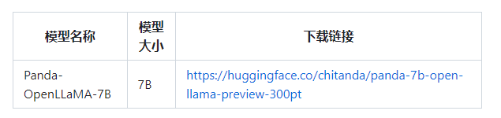

# 【LLMs 入门实战】 Panda LLM 模型学习与实战
 
- 论文名称：Panda LLM: Training Data and Evaluation for Open-Sourced Chinese Instruction-Following Large Language Models
- 论文地址：https://arxiv.org/pdf/2305.03025v1.pdf
- Github 代码：https://github.com/dandelionsllm/pandallm

## 一、前言

### 1.1 动机

大家在评估大模型的时候，想必都遇到过以上的问题。现如今，大模型的指令微调方法犹如雨后春笋般涌现，前途看似一马平川，然而仍有一朵“乌云”笼罩在我们上空，那就是：「如何实现保护隐私、可靠、可复现及廉价的大模型评估？」

当前，大家评估大模型的方法主要有两个：

- 调用OpenAI的API接口；
- 雇佣专家进行人工标注。 然而，发送数据给OpenAI可能会像三星员工泄露代码一样造成数据泄露问题 [1]；雇佣专家标注大量数据又十分费时费力且昂贵。

为了解决以上两个评估方案的问题，我们训练了一个专门用于评估大模型性能的裁判大模型：「PandaLM」，并提供了接口，仅需「三行」代码就可以调用PandaLM大模型进行保护隐私、可靠、可复现及廉价的大模型评估。训练PandaLM的细节在我们的开源项目中已给出。为了验证PandaLM的大模型评估能力，我们构建了一个多样化的包含约1,000个样本的人工标注测试集，其上下文和标签均由人类创建。「在我们的测试数据集上，PandaLM-7B在准确度达到了ChatGPT（gpt-3.5-turbo）的94%的水平」。

### 1.2 软件资源

- CUDA 11.7
- Python 3.10
- pytorch 1.13.1+cu117

## 二、环境搭建

### 2.1 下载代码 

```s
    $ git clone https://github.com/dandelionsllm/pandallm
```

### 2.2 构建环境

```s
    $ conda create -n py310_chat python=3.10       # 创建新环境
    $ source activate py310_chat                   # 激活环境
```

### 2.3 安装依赖 

```s
    $ cd pandallm
    $ pip install -r requirements.txt -i https://pypi.tuna.tsinghua.edu.cn/simple
```

### 2.4 安装 lfs 方便本地下载 LLaMa 大模型

```s
    $ git lfs install

    # 下载7B模型到本地
    $ bash ./base_models/load.sh
```

> ./base_models/load.sh 源码介绍
```s
#!/bin/bash
# 下载 llama-7b-hf
base_model_pir="./base_models/llama-7b-hf"
if [ ! -d $base_model_pir ];then
  cd ../base_models/ || exit
  git clone https://huggingface.co/decapoda-research/llama-7b-hf
  cd ../ || exit
fi

# 下载 Linly-Chinese-LLaMA-7b-hf
base_model_pir="./base_models/Linly-Chinese-LLaMA-7b-hf"
if [ ! -d $base_model_pir ];then
  cd ../base_models/ || exit
  git clone https://huggingface.co/P01son/Linly-Chinese-LLaMA-7b-hf
  cd ../ || exit
fi

```

## 三、模型推理

### 3.1 模型下载

1. 不可商用


2. 可商用（OpenPandaLLM系列）



### 3.2 模型推理

在项目中，不仅支持使用Web UI使用PandaLM以便于进行案例分析，为了方便使用，还支持三行代码调用PandaLM对任意模型和数据生成的文本评估。考虑到现有的许多模型、框架并不开源或难以在本地完成推理，支持利用指定模型权重生成待评估文本，或直接传入包含待评估文本的.json文件。用户只需传入一个包含模型名称/HuggingFace模型ID或.json文件路径的列表，即可利用PandaLM对用户定义的模型和输入数据进行评估。下面是一个极简的使用示例：

```s
  from pandalm import EvaluationPipeline
  print(pipeline.evaluate())
  pipelinemEvaluationPipeline([",/llama-7b",",/opt-7b","xxx-model.json"],input_data_patha"test,json")
```

当然，为了能让大家灵活的运用PandaLM进行自由评测，也将PandaLM的模型权重公布在了huggingface网站上，可以通过以下命令加载PandaLM-7B模型：

```s
  from transformers import AutoTokenizer， AutoModelForCausalLMtokenizer = AutoTokenizer,from_pretrained("WeOpenML/PandalM-7B-v1",use_fast=False)model = AutoModelForCausallM.from pretrained("WeOpenML/PandalM-7B-v1")
```

## 四、模型微调

1. 对应模型的训练时超参数见：

```s
# LLaMA-7b pretrain on general Chinese Corpus
conf/llama/zh/llama_7b_zh_instruct_v1_0_ds.yaml

# LLaMA-7b instruction tuning on COIG
conf/llama/zh/llama_7b_zh_instruct_coig_sft_v1_0_ds.yaml

# LLaMA-13b pretrain on general Chinese Corpus
conf/llama/zh/llama_13b_zh_instruct_v1_0_ds.yaml
```

2. 训练命令

```s
  $ HYDRA_FULL_ERROR=1 deepspeed --include localhost:0,1,2,3,4,5,6,7 trainer_base_ds_mul.py -cp conf/llama/zh -cn <file name of yaml config> 
```

## 填坑笔记


## 参考

1. [Panda LLM: Training Data and Evaluation for Open-Sourced Chinese Instruction-Following Large Language Models](https://arxiv.org/pdf/2305.03025v1.pdf)
2. [dandelionsllm/pandallm](https://github.com/dandelionsllm/pandallm)
