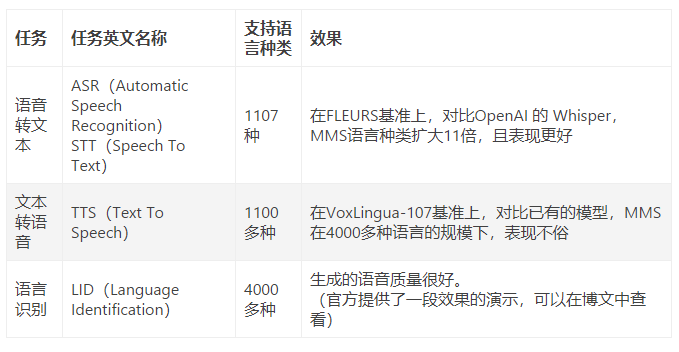
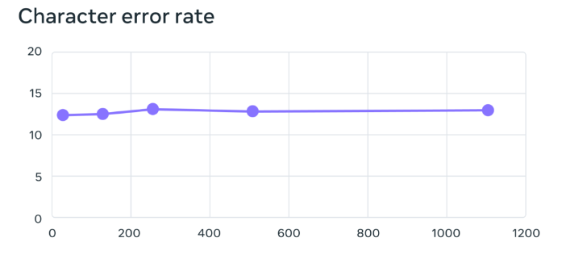
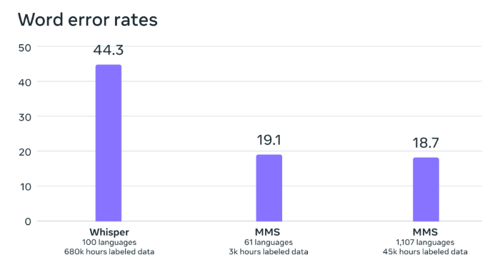

# 【LLMs 入门实战 —— 二十一】 Massively Multilingual Speech (MMS，大规模多语种语音) 模型学习与实战
 
1. 论文：[Scaling Speech Technology to 1,000+ Languages](https://research.facebook.com/publications/scaling-speech-technology-to-1000-languages/)
2. 代码：[fairseq/tree/main/examples/mms](https://github.com/facebookresearch/fairseq/tree/main/examples/mms)
3. 公告：https://ai.facebook.com/blog/multilingual-model-speech-recognition/

## 一、前言

### 1.1 介绍

Meta 在 GitHub 上再次开源了一款全新的 AI 语言模型——Massively Multilingual Speech (MMS，大规模多语种语音)，它与 ChatGPT 有着很大的不同，这款新的语言模型可以识别 4000 多种口头语言并生成 1100 多种语音（文本到语音）。

在此之前的模型可以覆盖大约100种语言，而这次，MMS直接把这个数字增加了10-40倍！

具体来说，Meta开放了1100多种语言的多语种语音识别/合成模型，以及4000多种语言的语音识别模型。

与OpenAI Whisper相比，多语言ASR模型支持11倍以上的语言，但在54种语言上的平均错误率还不到FLEURS的一半。

而且，将ASR扩展到如此多语言之后，只造成了非常小的性能下降。

### 1.2 动机

对于开发这款 MMS 模型，Meta 表示，「为设备配备识别和产生语音的能力可以让更多的人访问信息」。

不过，虽然全球已知的语言种类高达 7000 多种，但是现有的 AI 语音识别模型仅能够涵盖 100 种语言，范围太小了。

同时，语音识别和文本转语音模型通常需要对数千小时的音频进行训练，对于大多数语言而言，这些数据根本就不存在。甚至全球多种语言在时代不断发展中，会有不少在未来几十年有消失的危险。

为了能够保护世界上语言的多样性，也想要为濒临消失的语言做一些贡献，Meta 研究团队研发并开源了 MMS，「我们公开分享我们的模型和代码，以便研究界的其他人可以在我们工作的基础上进行构建」。

当然，想要收集数千种语言的音频数据是开发这款大模型首先需要克服的困难。

### 1.3 音频数据收集

在最新的 MMS 开源语音模型中，Meta 使用了一种非常规的方法来收集音频数据，他们使用了圣 经等宗教文本。

Meta 对此解释称，“我们使用宗教文本，是因为这些文本已被翻译成多种不同的语言，并且其译文已被广泛研究用于基于文本的语言翻译研究。这些翻译有公开的录音，记录了人们用不同的语言阅读这些文本的情况。” 

作为大模型项目的一部分，Meta 创建了 1100 多种语言的数据集，每种语言平均提供 32 小时的数据。

另外，结合圣 经和类似文本的未标记录音，Meta 的研究人员将模型的可用语言增加到 4,000 多种。

### 1.4 软件资源

- CUDA 11.7
- Python 3.10
- pytorch 1.13.1+cu117

### 1.5 3个主要的精调模型



## 二、环境搭建

### 2.1 下载代码 

```s
    $ git clone https://github.com/facebookresearch/fairseq.git
```

### 2.2 构建环境

```s
    $ conda create -n py310_chat python=3.10       # 创建新环境
    $ source activate py310_chat                   # 激活环境
```

### 2.3 安装依赖 

```s
    $ cd fairseq
    $ pip install -r requirements.txt -i https://pypi.tuna.tsinghua.edu.cn/simple
```


## 三、模型推理


## 四、模型微调


## 遇到的挑战

### 挑战一：数千种语言语音训练数据的获取

- 挑战：数据范围广，需要获取数千种语言的语音数据
- 方法：使用宗教文本，比如圣经。这些内容被广泛翻译、传播和录音。
- 结果：
  - 创建了1,100 多种语⾔的新约读物数据集 ， 每种语⾔平均提供32⼩时的数据录音。
  - 使用各种其他基督教宗教读物的⽆标签录⾳，将可⽤语⾔的数量增加到4000多种。

即使在宗教内容的数据进行训练，且男性的数据样本更多的情况下，Meta认为由于使⽤了连接主义时间分类⽅法，模型在对男声和女声的识别效果同样出色，也没有过度偏向于产⽣更多的宗教语⾔。

### 挑战二：数据预处理

- 挑战：语音时间长，需要将文本和语音对齐
- 方法：在100多种语⾔的现有数据上训练对⻬模型，并将该模型与⼀种⾼效的强制对⻬算法结合使⽤，该算法可以处理⼤约 20 分钟或更⻓时间的超⻓录⾳ 。

对齐算法已经封装到PyTorch，结合对齐模型，可以让其他研究人员创建新的语音数据集。

### 挑战三：语音时长短，无法从头开始训练模型

- 挑战：每种语⾔32⼩时的数据不⾜以训练传统的监督式语⾳识别模型
- 方法：在已有语音模型 wav2vec 2.0 之上，使用数据进行微调。

wav2vec 2.0 是 Meta 之前关于⾃监督语⾳表示学习的⼯作 ， 在其上微调可以⼤⼤减少了训练良好系统所需的标记数据量 。

## 模型实验结论

当然，依靠这些数据，很多人认为这个是偏向宗教的一种 AI 模型。事实上，Meta 表示，并非如此。

Meta 在公告中写道，“虽然录音的内容是宗教的，但我们的分析表明，这并没有使模型过度偏向于产生更多的宗教语言。我们认为这是因为我们使用了连接主义时间分类 (CTC) 方法，与用于语音识别的大型语言模型 (LLM) 或序列到序列模型相比，这种方法受到的限制要大得多。” 

在训练这个模型时，Meta 结合使用了自家公司的“自监督语音表示学习”模型——wav2vec 2.0，它可以在未标记的数据上进行训练。结合非常规数据源和自我监督的语音模型能够带来不错的效果。

根据官方测试数据表明，与现有的模型相比，Meta 在使用 1B 参数 wav2vec 2.0 模型在 1,100 多种语言上训练了多语言语音识别模型。随着语言数量的增加，性能确实会下降，但幅度很小：从 61 种语言增加到 1,107 种语言，字符错误率仅增加了约 0.4%，但语言覆盖率增加了 18 倍以上。



在与 OpenAI 的 Whisper 模型比较时，其在 Massively Multilingual Speech 数据上训练的模型实现了一半的单词错误率，但 Massively Multilingual Speech 涵盖的语言是其 11 倍。



毋庸置疑，MMS 开源模型的到来，不仅扩大了文本生成语音的语言范围，也极大地提升了准确率。

## 局限性

不过，Meta 警告说它的新模型并不完美。该公司写道：“例如，语音转文本模型可能会错误转录选定的单词或短语，这存在一定风险。” 

“根据输出结果，这可能会导致攻击性或不准确的语言。我们仍然相信，整个 AI 社区的协作对于负责任地开发 AI 技术至关重要。”

对于语音大模型的未来，Meta 称也做了设想，希望可以通过一个模型解决所有语言的多个语音任务。“虽然我们为语音识别、语音合成和语言识别训练了不同的模型，但我们相信在未来，一个模型将能够完成所有这些任务以及更多任务，从而带来更好的整体性能”，Meta 说道。


## 填坑笔记


## 致谢

本项目参考了以下开源项目，在此对相关项目和研究开发人员表示感谢。

## 参考

1. 论文：[Scaling Speech Technology to 1,000+ Languages](https://research.facebook.com/publications/scaling-speech-technology-to-1000-languages/)
2. 代码：[fairseq/tree/main/examples/mms](https://github.com/facebookresearch/fairseq/tree/main/examples/mms)
3. 公告：https://ai.facebook.com/blog/multilingual-model-speech-recognition/
4. [识别 4000 种语言、生成 1000 多种语音，Meta 开源大模型再下一城](https://www.36kr.com/p/2271729480294146)
5. [规模性能双杀OpenAI，Meta语音达LLaMA级里程碑，开源MMS模型可识别1100+语言](https://36kr.com/p/2269999680380937)
6. [Meta 发布语音识别大模型，支持1100多种语言](https://www.jianshu.com/p/b98b75d4269b)

