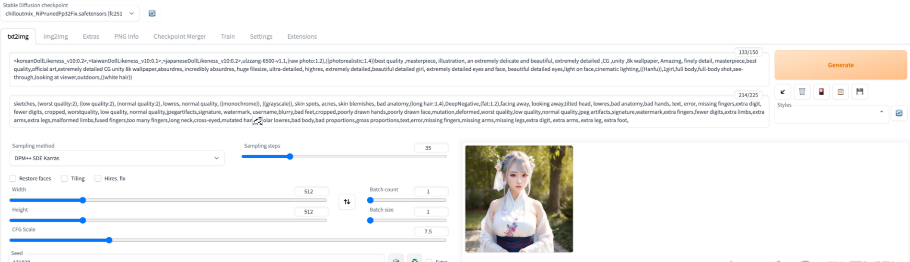

# 【关于 lora 方法】那些你不知道的事

## 一、前言

前几年如果你在朋友圈看到 【照骗】 可能只是用 国产PS 修过的图片，但是，如果你现在刷到 【照骗】，别心动，可能她就不是真人，而是靠 AI 生成的照片！！！


<hr/>


你以为的AI图片生成：根据提示弄出一幅简单或者抽象的画

现实版的AI图片生成：可以直接生成逼真的照片，然后玩cosplay了

<hr/>


## 二、动手实践


### 2.1 安装anaconda

如果没有anaconda，需要先安装anaconda。如果已经安装了anaconda，请跳过此步骤。

下载anaconda安装包：https://www.anaconda.com/

打开安装包，一路点击安装。

### 2.2 添加环境变量

安装完毕后，打开终端，输入conda，如果提示命令无法识别，则需要添加环境变量。如果能够正确识别，请跳过此步骤。

修改.bash_profile，终端里输入：

```s
    vi ~/.bash_profile
```

添加路径，注意改为自己的安装路径：

```s
    export PATH="/Users/(你自己的路径)/anaconda3/bin:$PATH"
```

使用:wq保存并退出vim：先按冒号，然后输入wq，回车。

### 2.3 修改conda源

因为国内下载 python 工具包 下载速度会受限，所以建议 改用 国内镜像。

终端输入：

（后续代码部分皆为在终端里输入内容）

```s
    conda config --add channels <https://mirrors.tuna.tsinghua.edu.cn/anaconda/pkgs/free/>
    conda config --set show_channel_urls yes
```

### 2.4 下载 stable-diffusion-webui 项目

接下来 需要 下载 stable-diffusion-webui 项目：

```s
    git clone <https://github.com/AUTOMATIC1111/stable-diffusion-webui
    > cd stable-diffusion-webui
```

### 2.5 安装依赖

安装 stable-diffusion-webui 依赖：

```s
    pip install -r requirements_versions.txt
```

### 2.6 下载预训练模型

下载预训练模型 ： https://huggingface.co/runwayml/stable-diffusion-v1-5

Chilloutmix模型（LoRA模型）：https://civitai.com/models/6424/chilloutmix

Counterfeit模型（checkpoint模型）：https://civitai.com/models/4468/counterfeit-v25

Korean Doll Likeness模型（LoRA模型）：https://civitai.com/models/7448/korean-doll-likeness

### 2.7 预训练模型位置添加

- 将 checkpoint模型，添加到models/Stable-diffusion⽬录下。
- 将 LoRA模型，添加到models/Lora目录下。

### 2.8 运行项目

修改运行参数，以便跳过 GPU 检测：

```s
export COMMANDLINE_ARGS="--lowvram --precision full --no-half --skip-torch-cuda-test"
export PYTORCH_ENABLE_MPS_FALLBACK=1
```

运行项目：

```s
python launch.py
```

浏览器打开如下网址：http://127.0.0.1:7860

输入你自己的生成参数，或者去https://civitai.com/复制别人的参数，点击页面上的「Generate」，开始绘画。

由于使用的是CPU，速度较慢，请耐心等待。

如果想要快速出图，请调低分辨率。

跑完之后是这样的：



### 2.9 后续运行

以后每次运行，只需执行如下几步：

打开终端，切换至 stable diffusion 目录：

```s
cd stable-diffusion-webui
```

修改运行参数：

```s
export COMMANDLINE_ARGS="--lowvram --precision full --no-half --skip-torch-cuda-test"
export PYTORCH_ENABLE_MPS_FALLBACK=1
```

执行项目：

```s
python launch.py
```

浏览器打开：http://127.0.0.1:7860


## 参考

1. [Stable Diffusion的入门介绍和使用教程](https://blog.csdn.net/tMb8Z9Vdm66wH68VX1/article/details/128526885)
2. [使用 LoRA 进行 Stable Diffusion 的高效参数微调](https://mp.weixin.qq.com/s/kEGwA_7qAKhIuoxPJyfNuw)
3. [老 Mac 还能一战：在 CPU 下通过 Stable Diffusion 进行 AI 绘画](https://zhuanlan.zhihu.com/p/607843476)
4. [diffusers Schedulers](https://huggingface.co/docs/diffusers/using-diffusers/schedulers)
5. [（跨模态）AI作画——使用stable-diffusion生成图片](https://blog.csdn.net/weixin_44826203/article/details/126768935)
6. [要点初见：AI绘图工具的部署资源、攻略整理（上篇）](https://blog.csdn.net/m0_37857300/article/details/127228680)
7. [要点初见：AI绘图工具的部署资源、攻略整理（下篇）](https://blog.csdn.net/m0_37857300/article/details/127231635)
8. [要点初见：开源AI绘画工具Stable Diffusion代码分析（文本转图像）、论文介绍（上）](https://blog.csdn.net/m0_37857300/article/details/127268745)
9. [要点初见：开源AI绘画工具Stable Diffusion代码分析（文本转图像）、论文介绍（下）](https://blog.csdn.net/m0_37857300/article/details/127389536)
10. [要点初见：Stable Diffusion NovelAI模型优质文字Tag汇总与实践【魔咒汇总】](https://blog.csdn.net/m0_37857300/article/details/127445588)
11. [Stable Diffusion 照骗级国风 个人制做的写实模型+国风汉服少女lora模型](https://www.bilibili.com/read/cv21493779)
12. [johnsmith007/LoRAs](https://huggingface.co/johnsmith007/LoRAs/tree/main)
13. [huggingface/safetensors](https://github.com/huggingface/safetensors)
14. [cloneofsimo/lora](https://github.com/cloneofsimo/lora)
15. [microsoft/LoRA](https://github.com/microsoft/LoRA)
16. [AI绘画教程进阶篇（6）实战：LORA模型训练叠加controlnet，COSPLAYER都要担忧要失业了](https://mp.weixin.qq.com/s/laOQ6udr87gVNsxgMvI7SA)


## 问题篇

### 安装 报 ImportError: cannot import name 'CLIPSegProcessor' from 'transformers'

1. 报错内容

```s
    $ ImportError: cannot import name 'CLIPSegProcessor' from 'transformers'
```

2. 解决方法

```s
    $ pip install -U transformers-4.26.1
```

### ImportError: cannot import name 'EulerAncestralDiscreteScheduler' from 'diffusers' 

1. 报错内容

```s
>>> from diffusers import StableDiffusionPipeline, EulerAncestralDiscreteScheduler
Traceback (most recent call last):
  File "<stdin>", line 1, in <module>
ImportError: cannot import name 'EulerAncestralDiscreteScheduler' from 'diffusers' (/home/kaimo/anaconda3/envs/py38_lda/lib/python3.8/site-packages/diffusers/__init__.py)
```

2. 解决方法

```s
    $ pip install diffusers==0.12.0
```


