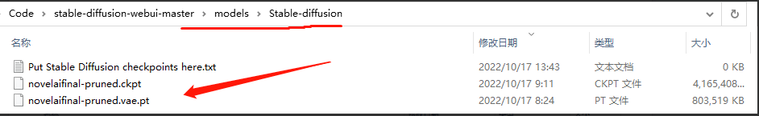
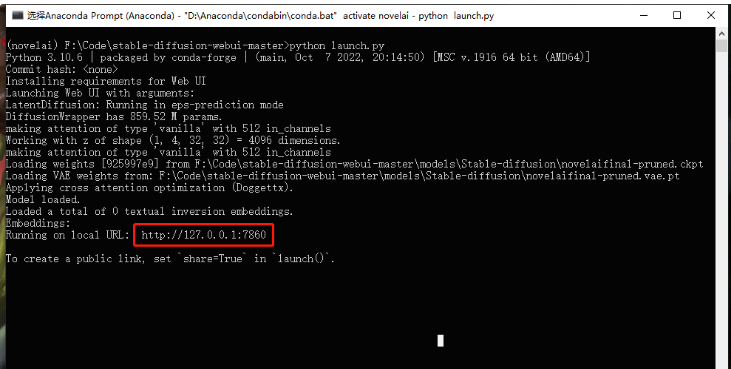

# 【关于 NovelAi】那些你不知道的事

## 一、下载代码

```s
    $ git clone https://github.com/AUTOMATIC1111/stable-diffusion-webui
```

## 二、创建 Anaconda 虚拟环境

```s
    $ conda create -n novelai python==3.10.6
```

## 三、激活 conda 虚拟环境

```s
    $ conda activate novelai
```

## 四、第三方库依赖安装

进入项目根目录，然后作者注明的第三方依赖库。

```s
    $ python -m pip install -r requirements.txt
```

## 五、下载模型文件

NovelAI 的模型训练文件泄漏出来了，我直接放到网盘分享出来了。

权重下载链接（提取码：jack ）：

https://pan.baidu.com/s/1BJ-5Zo7FnCxh7ezJtYEqIg?pwd=jack 

将模型文件解压缩放到 models 目录下，

在 models/Stable-diffusion 里，可以看到这几个文件：



## 六、运行 Web UI

```s
    $ python launch.py
```

第一次运行，这个过程中也会下载一些依赖库和权重文件，耐心等待即可。




## 参考

1. [AI 杀疯了，NovelAI开源教程](https://cloud.tencent.com/developer/article/2145004)