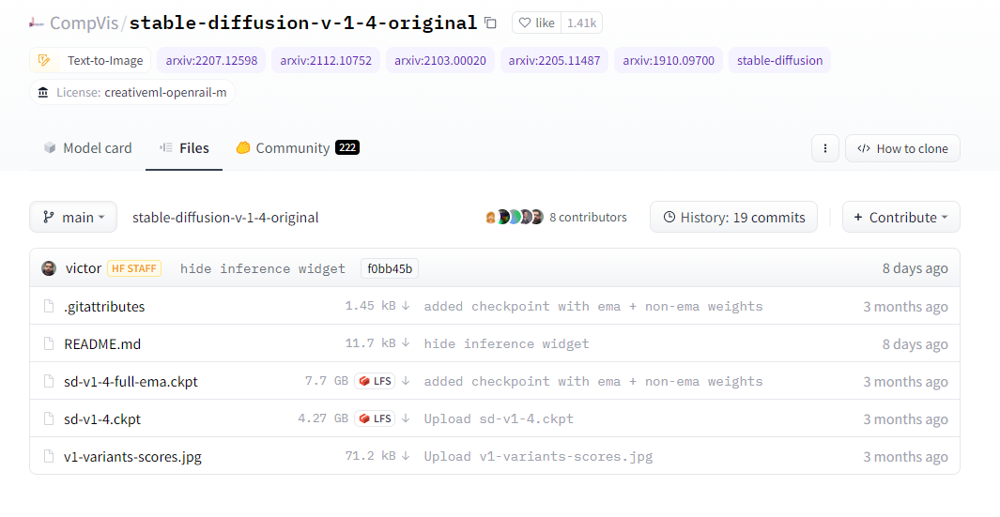
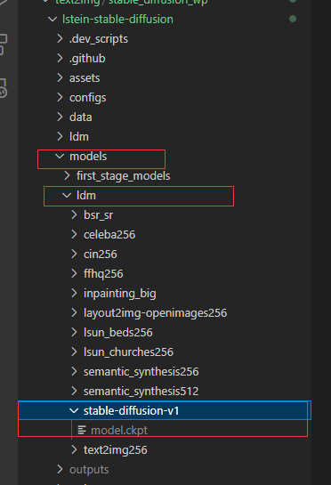

# 【关于 Stable Diffusion 方法】那些你不知道的事

> github 项目：https://github.com/invoke-ai/InvokeAI

## requirement

NVIDIA GPU，至少4GB VRAM，本地磁盘至少有15GB的空间，我们打包的项目解压后需要11G的磁盘。

## 一、下载模型权重

1. 注册 Hugging Face 账号并登录（注册后去邮箱验证一下）；
2. 打开 [CompVis/stable-diffusion](https://huggingface.co/CompVis/stable-diffusion) 页面，找到「stable-diffusion-v-1-4-original」并单击打开链接。（目前最新的版本是 1.4，如果以后有更新也可以来这里下载更新的版本）


3. clone 模型权重

```s
    git lfs install
    git clone https://huggingface.co/CompVis/stable-diffusion-v-1-4-original
```



> 文件很大4.2GB,需要确保下载文件是完整的

## 二、下载 gitHub 项目

从这个GitHub存储库下载下载Stable Diffusion，https://github.com/gediz/lstein-stable-diffusion.git。它是由lstein修改的原始源代码的一个分支，感谢lstein。

```s
    git clone https://github.com/gediz/lstein-stable-diffusion.git
```

在“models/ldm”文件夹中，创建一个名为“stable-diffusion-v1”的文件夹



复制下载的模型文件sd-v1-4到stable-diffusion-v1文件夹中，将检其重命名为model.ckpt。

## 三、构建 项目依赖环境

1. 进入 项目

2. 使用Anaconda创建运行环境

```s
    conda env create -f environment.yaml 
```

> 下载运行模型所需的所有依赖项和包。这里的文件也很大，大概几个GB，所以可能需要一段时间

4. 进入 ldm 环境

```s
    conda activate ldm
```

## 四、加载 ML模型

加载模型需要的几个小ML模型

```s
$ python scripts/preload_models.py
preloading bert tokenizer...
...success
preloading Kornia requirements (ignore the deprecation warnings)...
Downloading: "https://github.com/DagnyT/hardnet/raw/master/pretrained/train_liberty_with_aug/checkpoint_liberty_with_aug.pth" to /home/kaimo/.cache/torch/hub/checkpoints/checkpoint_liberty_with_aug.pth
100%|████████████████████████████████████████████████████████████████████████████| 5.10M/5.10M [00:04<00:00, 1.11MB/s]
...success
preloading CLIP model (Ignore the deprecation warnings)...
Downloading: 100%|██████████████████████████████████████████████████████████████████| 939k/939k [00:03<00:00, 257kB/s]
Downloading: 100%|██████████████████████████████████████████████████████████████████| 512k/512k [00:02<00:00, 202kB/s]
Downloading: 100%|████████████████████████████████████████████████████████████████████| 389/389 [00:00<00:00, 207kB/s]
Downloading: 100%|████████████████████████████████████████████████████████████████████| 905/905 [00:00<00:00, 497kB/s]
Downloading: 100%|███████████████████████████████████████████████████████████████| 4.41k/4.41k [00:00<00:00, 2.19MB/s]
Downloading: 100%|████████████████████████████████████████████████████████████████| 1.59G/1.59G [36:26<00:00, 782kB/s]

...success

```

## 五、生成图像

```s
$ python dream.py 
* Initializing, be patient...

>> Loading model from models/ldm/stable-diffusion-v1/model.ckpt
LatentDiffusion: Running in eps-prediction mode
DiffusionWrapper has 859.52 M params.
making attention of type 'vanilla' with 512 in_channels
Working with z of shape (1, 4, 32, 32) = 4096 dimensions.
making attention of type 'vanilla' with 512 in_channels
>> Using half precision math. Call with --full_precision to use more accurate but VRAM-intensive full precision.
>> Setting Sampler to k_lms
>> model loaded in 9.87s

* Initialization done! Awaiting your command (-h for help, 'q' to quit)
dream> photo of miniature Australian Shepherd puppy on pier in front of breathtaking mountain lake, epic scene, beautiful colors, high resolution
Generating:   0%|                                                                               | 0/1 [00:00<?, ?it/s] DEBUG: seed at make_image() invocation time =2057123996
100%|█████████████████████████████████████████████████████████████████████████████████| 50/50 [00:04<00:00, 11.08it/s]
Generating: 100%|███████████████████████████████████████████████████████████████████████| 1/1 [00:04<00:00,  4.73s/it]
>> Usage stats:
>>   1 image(s) generated in 4.74s
>>   Max VRAM used for this generation: 4.44G
Outputs:
outputs/img-samples/000001.2057123996.png: "photo of miniature Australian Shepherd puppy on pier in front of breathtaking mountain lake, epic scene, beautiful colors, high resolution" -s50 -W512 -H512 -C7.5 -Ak_lms -S2057123996

```


## 问题解决

### 1. ModuleNotFoundError: No module named 'taming'

- 问题描述

按 作者  environment.yaml  安装可能 会 安装不上 taming-transformers，所以 手动利用以下方式安装

```s
    $ git clone https://github.com/CompVis/taming-transformers.git
    $ cd taming-transformers
    $ python setup.py install
```

虽然安装成功了，但是运行 会 报错

```s
    ModuleNotFoundError: No module named 'taming'
```

- 解决方法

```s
    $ pip uninstall taming-transformers
    $ pip install taming-transformers==0.0.1
```

该问题得到解决

### 2. ImportError: cannot import name 'VectorQuantizer2' from 'taming.modules.vqvae.quantize'

- 问题描述

第一个问题解决之后，再次运行会出现下面错误

```s
    ImportError: cannot import name 'VectorQuantizer2' from 'taming.modules.vqvae.quantize' (/home/kaimo/anaconda3/envs/py38_lda/lib/python3.8/site-packages/taming/modules/vqvae/quantize.py)
```

- 解决方法

修改 lstein-stable-diffusion/ldm/models/autoencoder.py 文件

```s
    from iming.modules.vqvae.quantize import VectorQuantizer2 as VectorQuantizer
    to
    from taming.modules.vqvae.quantize import VectorQuantizer as VectorQuantizer
```

## 参考

1. [InvokeAI](https://github.com/invoke-ai/InvokeAI)
2. [CompVis/stable-diffusion](https://huggingface.co/CompVis/stable-diffusion)
3. [在自己电脑运行Stable Diffusion和完整项目下载](https://zhuanlan.zhihu.com/p/565851314)
4. [stable diffusion安装与简单评测](https://zhuanlan.zhihu.com/p/563731965)