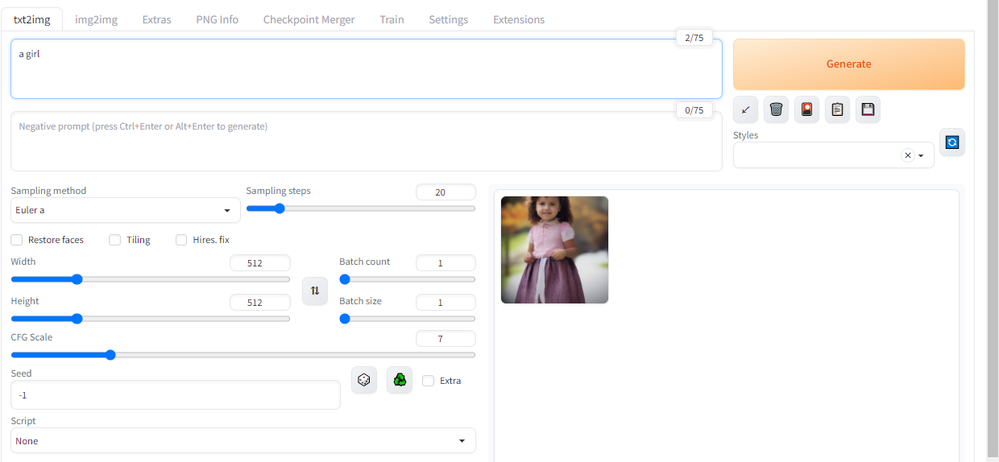
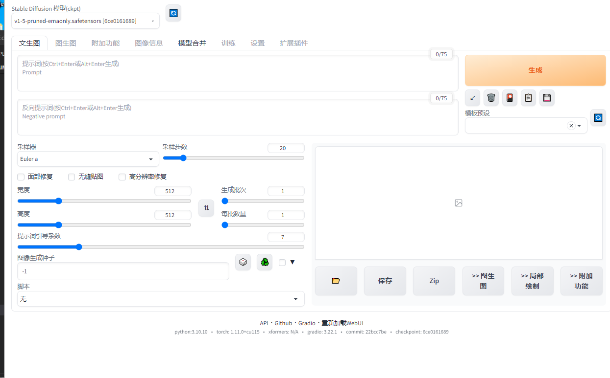
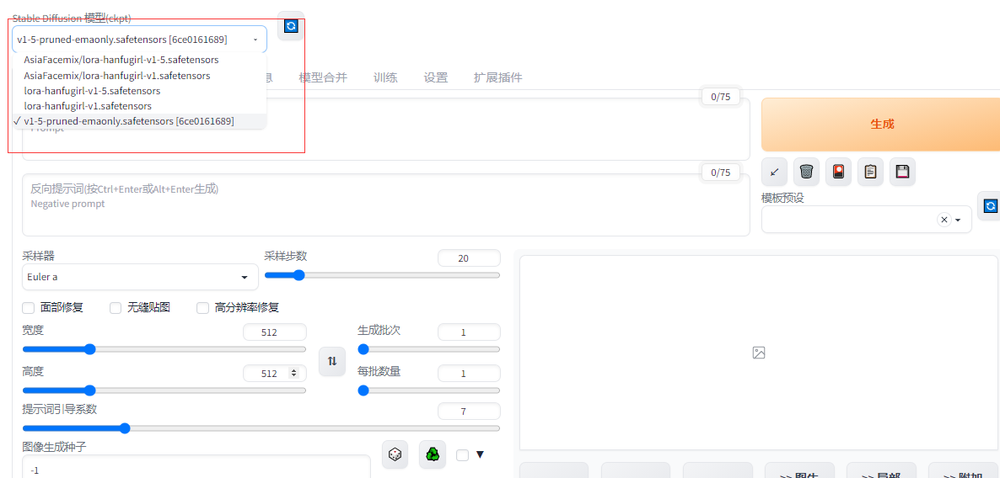

# Stable-Diffusion-WebUI

## 一、安装配置篇

### 1.1 安装 python 3.10 

stable-diffusion-webui官方git上用的是python3.10.6。我自己测试了一下Python3.10.10和Python3.10.9都是可以的，至少要Python3.10以上，不然很多包是不支持的。

1. 下载Anaconda安装包：

```s
    $ wget https://repo.continuum.io/archive/Anaconda3-5.3.1-Linux-x86_64.sh
```

2. 进入安装包所在目录，使用bash指令进行anaconda安装：

```s
    $ bash Anaconda3-5.3.1-Linux-x86_64.sh
```

3. 查看安装结果：

```s
    $ conda info
```

> Anaconda简单使用：
```s
    1、创建环境：conda create -n <env_name> <packages>

    例如：conda create -n python3.10.9 python==3.10.9

    2、激活环境：conda activate <env_name>
    3、退出环境：conda deactivate <env_name>
    4、查看已安装的环境信息：conda env list
    5、复制环境：conda create -n <new_env_name> --clone <origin_env_name>
    6、删除环境：conda env remove -n <env_name>
    7、保存环境信息到environment.yaml文件中：conda env export > environment.yaml
    8、通过environment.yaml环境文件创建文件： conda env create -f environment.yaml
    9、查看已安装的包：conda list
    10、搜索包：conda search <package_name1>
    11、安装包：conda install <package_name1> <package_name2>
    12、卸载包：conda remove <package_name>
    安装过程会出现是否阅读注册信息、添加环境变量、安装VSCode等提示信息，全部按yes即可。
```

4. 构建 python 3.10 环境

```s
    $ conda create -n py310 python=3.10
```

### 1.2 stable-diffusion-webui 依赖安装

#### 1.2.1 依赖安装

1. clone stable-diffusion-webui

输入克隆命令获取源代码：

```s
    git clone https://github.com/AUTOMATIC1111/stable-diffusion-webui.git
```

输入命令后按回车，网络没问题的话，很快就能完成。完成后会出现100%和done的提示。

2. 先安装pytorch

> [pytorch 官网](https://pytorch.org/)

```s
    pip install torch torchvision torchaudio --index-url https://download.pytorch.org/whl/cu115
```

具体需要根据你们自己的cuda version版本去对应下载（命令行输入nvidia-smi，右上角的CUDA Version便是CUDA Driver API版本）

3. 安装webui依赖

cd到你下载的stable-diffusion-webui项目下：

先执行：

```s
    pip install -r requirements_versions.txt -i https://pypi.tuna.tsinghua.edu.cn/simple
```

再执行：

```s
    pip install -r requirements.txt -i https://pypi.tuna.tsinghua.edu.cn/simple
```

这边有可能有一些小坑需要注意:如果有一些包安装不上，你可以自己pip install 对应包，还有就是我在华为云上安装的时候，一开始一直有问题，发现是因为华为云pip直接调用的是https://repo.huaweicloud.com/repository/pypi/simple，导致很多包装不上，这边你可以切换到清华源上https://pypi.tuna.tsinghua.edu.cn/simple/。


#### 1.2.2 可能遇到问题

1. pip安装basicsr时卡在Preparing metadata

> 参考：[pip安装basicsr时卡在Preparing metadata](https://blog.csdn.net/nhy412369364/article/details/129279982)

- 解决方法

```s
    $ pip install torch -i https://pypi.tuna.tsinghua.edu.cn/simple
    $ BASICSR_EXT=True pip install basicsr
```

### 1.3 启动stable-diffusion-webui

#### 1.3.1 启动 stable-diffusion-webui 流程

stable-diffusion-webui 的 启动方式 有两种

- 方法一：运行 bash start.sh
- 方法二：运行 python launch.py --listen

> --listen 参数 表示 可以 远程访问 （参考：modules/cmd_args.py）

我自己是 方法二

1. 运行 python launch.py --listen

然后就是漫长的自动git clone相关包和模型文件的过程了，等着就好

```s
$ python launch.py
>>>
Python 3.10.10 (main, Mar 21 2023, 18:45:11) [GCC 11.2.0]
Commit hash: 22bcc7be428c94e9408f589966c2040187245d81
Installing requirements for Web UI
Launching Web UI with arguments: 
No module 'xformers'. Proceeding without it.
==============================================================================
You are running torch 1.11.0+cu115.
The program is tested to work with torch 1.13.1.
To reinstall the desired version, run with commandline flag --reinstall-torch.
Beware that this will cause a lot of large files to be downloaded, as well as
there are reports of issues with training tab on the latest version.

Use --skip-version-check commandline argument to disable this check.
==============================================================================
Loading weights [6ce0161689] from /base/project/text2img/stable-diffusion-webui/models/Stable-diffusion/v1-5-pruned-emaonly.safetensors
Creating model from config: /base/project/text2img/stable-diffusion-webui/configs/v1-inference.yaml
LatentDiffusion: Running in eps-prediction mode
DiffusionWrapper has 859.52 M params.
Applying cross attention optimization (Doggettx).
Textual inversion embeddings loaded(0): 
Model loaded in 9.6s (load weights from disk: 0.3s, create model: 0.3s, apply weights to model: 4.8s, apply half(): 0.3s, load VAE: 2.5s, move model to device: 1.2s).
Running on local URL:  http://127.0.0.1:7860

To create a public link, set `share=True` in `launch()`.
Startup time: 12.0s (import torch: 0.6s, import gradio: 0.5s, import ldm: 0.3s, other imports: 0.5s, load scripts: 0.2s, load SD checkpoint: 9.6s, create ui: 0.1s).
...
```

2. 打开浏览器 访问 http://127.0.0.1:7860/ （如果想 远程访问，可以参考 1.3.0.2 方法）

到这里你就可以成功部署了stable-diffusion-webui项目，剩下的就是如何使用了。

3. 使用 stable-diffusion-webui 生成 图片



#### 1.3.0 问题及解决方法

##### 1.3.0.1 部分包安装不上

python launch.py运行的（这边起的时候也会安装很多依赖，所以也会有些小坑，有些装不上的话，依然可以单独找版本然后pip install；还有两个环境运行的时候都遇到了安装open_clip装不上的问题，可以去launch.py中 对应的位置改为：

```s
    $ openclip_package = os.environ.get('OPENCLIP_PACKAGE', "git+https://gitee.com/ufhy/open_clip.git@bb6e834e9c70d9c27d0dc3ecedeebeaeb1ffad6b")
```

##### 1.3.0.2 报 cannot import name 'get_device' from 'basicsr.utils.misc'

> 参考：[cannot import name 'get_device' from 'basicsr.utils.misc'](https://github.com/AUTOMATIC1111/stable-diffusion-webui/issues/8101)

I also encountered this problem, so I copied the official code (https://github.com/sczhou/CodeFormer/blob/50489a6736ef6ac75f00582a646782049898fe43/basicsr/utils/misc.py#L21) into (/path/anaconda3/envs/py310_sd/lib/python3.10/site-packages/basicsr/utils/misc.py) to solve this problem

```s
import re

IS_HIGH_VERSION = [int(m) for m in list(re.findall(r"^([0-9]+)\.([0-9]+)\.([0-9]+)([^0-9][a-zA-Z0-9]*)?(\+git.*)?$",\
    torch.__version__)[0][:3])] >= [1, 12, 0]

def get_device(gpu_id=None):
    if gpu_id is None:
        gpu_str = ''
    elif isinstance(gpu_id, int):
        gpu_str = f':{gpu_id}'
    else:
        raise TypeError('Input should be int value.')
    if IS_HIGH_VERSION:
        if torch.backends.mps.is_available():
            return torch.device('mps'+gpu_str)
    return torch.device('cuda'+gpu_str if torch.cuda.is_available() and torch.backends.cudnn.is_available() else 'cpu')
```

## 二、stable-diffusion-webui 使用

### 2.1 如何使用stable-diffusion-webui

上述操作后，项目中models目录下会有一个自带的模型model/Stable-diffusion/v1-5-pruned-emaonly.safetensors。如果你想生成人像比较逼真的话需要下载一个chilloutmix_NiPrunedFp32Fix.safetensors模型文件，放到model/Stable-diffusion/目录下，另外还有很多具体人物形象的需要加载到model/Lora底下，例如我上图像迪丽热巴的那张就是下载了dilrabaDilmurat_v1.safetensors，加载到了model/Lora。

另外想生成更多更好的图片需要好的prompt和negative prompt

还是迪丽热巴那张对应的prompt：hair ornament, earrings, necklace, t-shirts, looking at viewer, solo, <lora:dilrabaDilmurat_v1:1>,full body, water,

negative prompt：(worst quality, low quality:1.2), watermark, username, signature, text

这边给大家两个网站有一个prompt和模型可以下载：

AI绘画咒语tag在线生成器：这个可以让你自己去对应的tag

https://civitai.com：这个里面有很多好看的模型


## 三、技巧

### 3.1 Stable Diffusion Web UI简体中文扩展

> 参考：[Stable Diffusion Web UI简体中文扩展](https://github.com/VinsonLaro/stable-diffusion-webui-chinese)

#### 3.1.1 Stable Diffusion Web UI简体中文扩展 安装说明

- 方法1：通过WebUI拓展进行安装

1. 打开stable diffusion webui，进入"Extensions"选项卡
2. 点击"Install from URL"，注意"URL for extension's git repository"下方的输入框
3. 粘贴或输入本Git仓库地址https://github.com/VinsonLaro/stable-diffusion-webui-chinese
4. 点击下方的黄色按钮"Install"即可完成安装，然后重启WebUI(点击"Install from URL"左方的"Installed"，然后点击黄色按钮"Apply and restart UI"网页下方的"Reload UI"完成重启)
5. 点击"Settings"，左侧点击"User interface"界面，在界面里最下方的"Localization (requires restart)"，选择"Chinese-All"或者"Chinese-English"
6. 点击界面最上方的黄色按钮"Apply settings"，再点击右侧的"Reload UI"即可完成汉化

- 方法2：直接复制翻译好的本地化模板

1. 在任意目录下使用git clone https://github.com/VinsonLaro/stable-diffusion-webui-chinese
2. 进入下载好的文件夹,把"localizations"文件夹内的"Chinese-All.json"和"Chinese-English.json"复制到"stable-diffusion-webui\localizations"目录下
3. 点击"Settings"，左侧点击"User interface"界面，在界面里最下方的"Localization (requires restart)"，选择"Chinese-All"或者"Chinese-English"
4. 点击界面最上方的黄色按钮"Apply settings"，再点击右侧的"Reload UI"即可完成汉化

#### 3.1.2 Stable Diffusion Web UI简体中文扩展 安装说明



### 3.2 添加 外部 safetensors 文件 （以 AsiaFacemix-pruned-fix.safetensors 为例）

> 参考：[请教safetensors存放位置的问题](https://tieba.baidu.com/p/8261826732)

- 动机：用了basil生成中国人感觉太丑了，发现个 lora-hanfugirl-v1-5.safetensors 和AsiaFacemix-pruned-fix.safetensors 文件可以大幅改善
- 操作：

1. 到 https://huggingface.co/dcy/AsiaFacemix/tree/main 网站 下载 AsiaFacemix-pruned-fix.safetensors

```s
  # Make sure you have git-lfs installed (https://git-lfs.github.com)
  git lfs install
  git clone https://huggingface.co/dcy/AsiaFacemix

  # if you want to clone without large files – just their pointers
  # prepend your git clone with the following env var:
  GIT_LFS_SKIP_SMUDGE=1
```

2. 将 .safetensors 放到 Stable Diffusion 模型目录下。（默认为 stable-diffusion-webui\models\Stable-diffusion ） 



3. safetensors 文件下载地址

- https://huggingface.co/dcy/AsiaFacemix （放到 Stable-diffusion 模型目录下）
  - AsiaFacemix-pruned-fix.safetensors
  - AsiaFacemix-pruned-fp16.safetensors
  - AsiaFacemix-pruned-fp16fix.safetensors
  - AsiaFacemix-pruned.safetensors
  - AsiaFacemix.safetensors
  - lora-hanfugirl-v1-5.safetensors
  - lora-hanfugirl-v1.safetensors

- https://huggingface.co/Eata/lora/tree/main （放到 Lora 模型目录下）
  - RealisticMixed.safetensors
  - ahegao_v1.safetensors
  - animeScreencapStyle_v230epochs.safetensors
  - anythingAnimeLoraNSFW_v15.safetensors
  - fashionGirl_v20SmallFileSize.safetensors
  - fashionGirl_v30ForSD15AndWaifu.safetensors
  - koreanDollLikeness_v10Feb082023.safetensors
  - koreanDollLikeness_v15Feb242023.safetensors
  - lora-hanfugirl-v1-5.safetensors
  - nixeuStyleLora_100.safetensors


<lora:koreanDoll ikeness_v15:0.66>, best quality, ultra high res, (photorealistic:1.4), 1girl, beige sweater, black choker, smile, laughing, bare shoulders, solo focus, (full body), (brown hair:1), looking at viewer

paintings,sketches,(worst quality:2), (low quality:2), (normal quality:2), lowres, normal quality, ((monochrome)), ((grayscale)), skin spots, acnes, skin blemishes, age spot, glans

pt文件放到embeddings文件夹下

python launch.py --listen --disable-safe-unpickle --no-half --disable-nan-check

python launch.py --listen --disable-safe-unpickle --disable-nan-check

### 3.3

## 四、问题篇

### 4.1 RuntimeError: Input type (torch.cuda.HalfTensor) and weight type (torch.FloatTensor)

- 问题描述

```s
100%|███████████████████████████████████████████████████████████████████████████████| 20/20 [00:02<00:00,  7.01it/s]
ERROR:    Exception in ASGI application█████████████████████████████████████████████| 20/20 [00:01<00:00, 14.84it/s]
Traceback (most recent call last):
  ...
  File "/base/project/text2img/stable-diffusion-webui/extensions-builtin/Lora/lora.py", line 319, in lora_Conv2d_forward
    return torch.nn.Conv2d_forward_before_lora(self, input)
  File "/base/anaconda3/envs/py310_sd/lib/python3.10/site-packages/torch/nn/modules/conv.py", line 447, in forward
    return self._conv_forward(input, self.weight, self.bias)
  File "/base/anaconda3/envs/py310_sd/lib/python3.10/site-packages/torch/nn/modules/conv.py", line 443, in _conv_forward
    return F.conv2d(input, weight, bias, self.stride,
RuntimeError: Input type (torch.cuda.HalfTensor) and weight type (torch.FloatTensor) should be the same
```

- 问题解析

Input： type (torch.cuda.HalfTensor) 
weight： type (torch.FloatTensor) 

类型不一致

- 解决方法

文件 中 (/base/project/text2img/stable-diffusion-webui/extensions-builtin/Lora/lora.py) line 319 将 weight 改为 和 Input 一个 类型即可

```s
def lora_Conv2d_forward(self, input):
    lora_apply_weights(self)
    self = self.half().to("cuda")              # 将 weight 改为 type (torch.cuda.HalfTensor) 
    return torch.nn.Conv2d_forward_before_lora(self, input)
```

### 4.2 模型文件 加载 过程 中 被 safe.py 中的 load_with_extra() 函数 拦截

- 问题描述

在 web 上面 生成 图片时，报下面错误

```s
...
model_path:/base/project/text2img/stable-diffusion-webui/models/VAE-approx/model.pt
Error verifying pickled file from /base/project/text2img/stable-diffusion-webui/models/VAE-approx/model.pt:
Traceback (most recent call last):
  File "/base/project/text2img/stable-diffusion-webui/modules/safe.py", line 135, in load_with_extra
    check_pt(filename, extra_handler)
  File "/base/project/text2img/stable-diffusion-webui/modules/safe.py", line 93, in check_pt
    unpickler.load()
  File "/base/project/text2img/stable-diffusion-webui/modules/safe.py", line 30, in persistent_load
    return TypedStorage()
  File "/home/kaimo/anaconda3/envs/py310_sd/lib/python3.10/site-packages/torch/storage.py", line 270, in __init__
    assert type(self) != _TypedStorage, (
AssertionError: Calling __init__ this way is only supported in _TypedStorage's child classes. _TypedStorage can only be directly instantiated when kwargs 'wrap_storage' and 'dtype' are given.

The file may be malicious, so the program is not going to read it.
You can skip this check with --disable-safe-unpickle commandline argument.

type(tmp_model):<class 'NoneType'>
Error completing request
Arguments: ('task(7vjsvdoqk0xwwv6)', 'a girl', '', [], 20, 0, False, False, 1, 1, 7, -1.0, -1.0, 0, 0, 0, False, 512, 512, False, 0.7, 2, 'Latent', 0, 0, 0, [], 0, False, False, 'positive', 'comma', 0, False, False, '', 1, '', 0, '', 0, '', True, False, False, False, 0) {}
Traceback (most recent call last):
  File "/base/project/text2img/stable-diffusion-webui/modules/call_queue.py", line 56, in f
    res = list(func(*args, **kwargs))
  File "/base/project/text2img/stable-diffusion-webui/modules/call_queue.py", line 37, in f
    res = func(*args, **kwargs)
  File "/base/project/text2img/stable-diffusion-webui/modules/txt2img.py", line 56, in txt2img
    processed = process_images(p)
  File "/base/project/text2img/stable-diffusion-webui/modules/processing.py", line 503, in process_images
    res = process_images_inner(p)
  File "/base/project/text2img/stable-diffusion-webui/modules/processing.py", line 598, in process_images_inner
    sd_vae_approx.model()
  File "/base/project/text2img/stable-diffusion-webui/modules/sd_vae_approx.py", line 49, in model
    sd_vae_approx_model.load_state_dict(tmp_model)
  File "/home/kaimo/anaconda3/envs/py310_sd/lib/python3.10/site-packages/torch/nn/modules/module.py", line 1470, in load_state_dict
    state_dict = state_dict.copy()
AttributeError: 'NoneType' object has no attribute 'copy'
```

- 问题定位

modules/sd_vae_approx.py 加载 模型文件

```s
def model():
    global sd_vae_approx_model

    if sd_vae_approx_model is None:
        model_path = os.path.join(paths.models_path, "VAE-approx", "model.pt")
        sd_vae_approx_model = VAEApprox()
        if not os.path.exists(model_path):
            model_path = os.path.join(paths.script_path, "models", "VAE-approx", "model.pt")
        sd_vae_approx_model.load_state_dict(torch.load(model_path, map_location='cpu' if devices.device.type != 'cuda' else None))              # 这一段 加载模型 出错
        sd_vae_approx_model.eval()
        sd_vae_approx_model.to(devices.device, devices.dtype)

    return sd_vae_approx_model
```

被 modules/safe.py 中的 load_with_extra() 函数 拦截

```s
def load_with_extra(filename, extra_handler=None, *args, **kwargs):
    """
        this function is intended to be used by extensions that want to load models with
        some extra classes in them that the usual unpickler would find suspicious.

        Use the extra_handler argument to specify a function that takes module and field name as text,
        and returns that field's value:

        ```python
        def extra(module, name):
            if module == 'collections' and name == 'OrderedDict':
                return collections.OrderedDict

            return None

        safe.load_with_extra('model.pt', extra_handler=extra)
        ```

        The alternative to this is just to use safe.unsafe_torch_load('model.pt'), which as the name implies is
        definitely unsafe.
    """

    from modules import shared

    try:
        if not shared.cmd_opts.disable_safe_unpickle:
            check_pt(filename, extra_handler)

    except pickle.UnpicklingError:
        print(f"Error verifying pickled file from {filename}:", file=sys.stderr)
        print(traceback.format_exc(), file=sys.stderr)
        print("-----> !!!! The file is most likely corrupted !!!! <-----", file=sys.stderr)
        print("You can skip this check with --disable-safe-unpickle commandline argument, but that is not going to help you.\n\n", file=sys.stderr)
        return None

    except Exception:
        print(f"Error verifying pickled file from {filename}:", file=sys.stderr)
        print(traceback.format_exc(), file=sys.stderr)
        print("\nThe file may be malicious, so the program is not going to read it.", file=sys.stderr)
        print("You can skip this check with --disable-safe-unpickle commandline argument.\n\n", file=sys.stderr)
        return None

    return unsafe_torch_load(filename, *args, **kwargs)
```

- 解决方法

运行 的 时候 添加  --disable-safe-unpickle

```s
  $ python launch.py --listen --disable-safe-unpickle
```


## 参考

1. [VinsonLaro/stable-diffusion-webui-chinese](https://github.com/VinsonLaro/stable-diffusion-webui-chinese)
2. [Ubuntu安装stable-diffusion-webui详细教程](https://zhuanlan.zhihu.com/p/611519270)
3. [生成你的专属定制老婆!——使用stable-diffusion-webui的Textual Inversion功能](https://www.bilibili.com/read/cv19040576)
4. [如何用AI绘图画出超真实细节感超强的小姐姐？（Lora篇）](https://zhuanlan.zhihu.com/p/610149293?s_r=0)
5. [炼丹阁](https://models.paomiantv.cn/models/)
6. [Stable Diffusion 学习](https://www.zhihu.com/people/yi-ke-fan-qie-39/posts)


