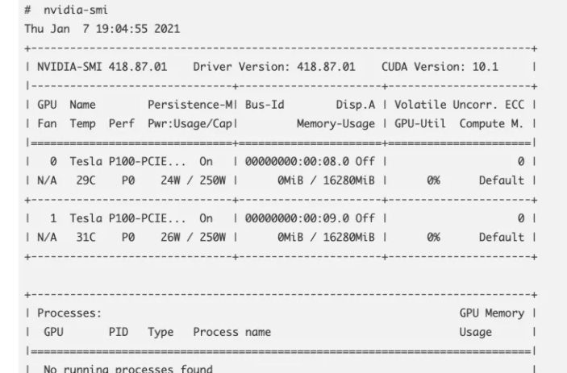
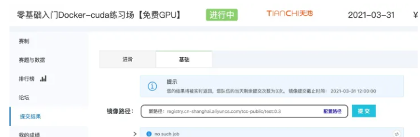
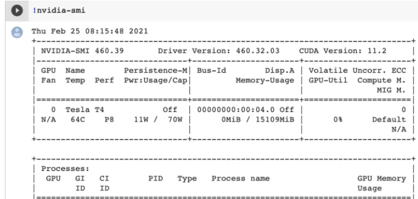
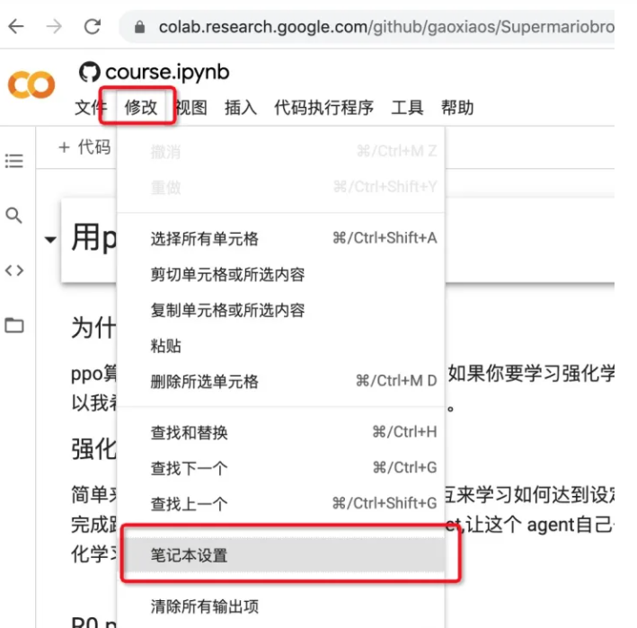
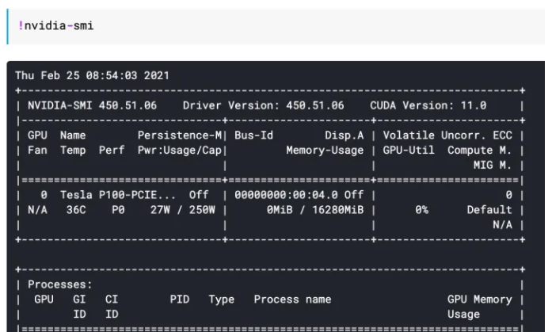
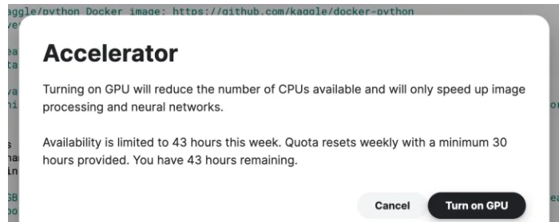
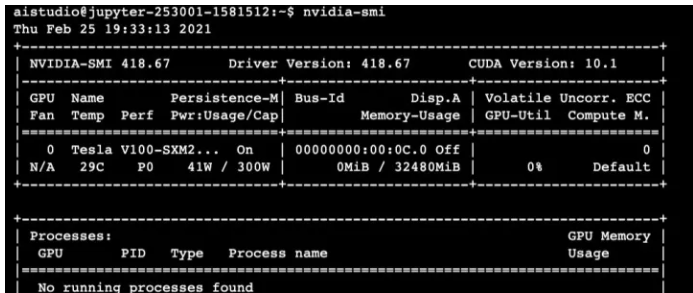
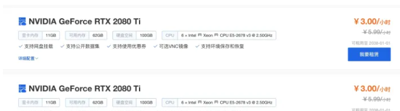
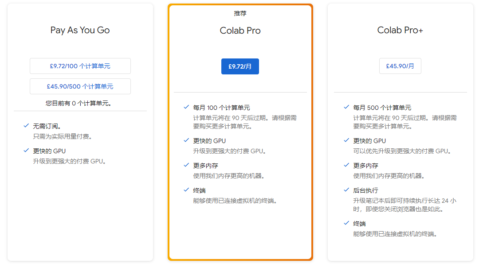
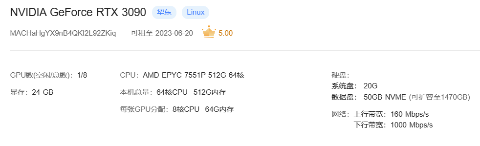

# 各大计算平台免费GPU资源 最全汇总

## 一、动机

很多想入门深度学习的小伙伴跟我说自己没有nvidia的gpu, 各大厂商的gpu服务器又好贵，往往被高成本的入门门槛给吓退了，那么今天我来给小伙伴总结下各大厂商都有哪些免费的GPU羊毛可褥～

## 二、各大计算平台免费GPU资源集结

### 2.1 阿里云天池TCC

- 算力：V100 16G显存 8c32g 
- 单次最长运行：24小时
- 推荐指数：⭐️⭐️⭐️⭐️⭐️
- 直达链接：零基础入门Docker-cuda练习场 [【免费GPU】赛题与数据-天池大赛-阿里云天池](https://tianchi.aliyun.com/competition/entrance/531863/information) 或  [零基础入门强化学习-经典游戏挑战赛赛题与数据-天池大赛-阿里云天池](https://tianchi.aliyun.com/competition/entrance/531854/information)

- 割羊毛方式：以docker形式提交代码 然后查看运行结果和日志

### 2.2 Google colab

- 算力： T4 16G显存
- 单次最长运行：12小时 (GPU/TPU)
- 推荐指数：⭐️⭐️⭐️⭐️⭐️
- 直达链接：[http://colab.research.google.com](http://colab.research.google.com)

- 割羊毛方式：以docker形式提交代码 然后查看运行结果和日志

> 默认colab是不配置GPU的 设置开启GPU方法如下：

### 2.3 Kaggle Notebook

- 算力： P100 16G显卡
- 单次最长运行：43H每周
- 推荐指数：⭐️⭐️⭐️⭐️
- 直达链接：[Run Data Science & Machine Learning Code Online | Kaggle](https://www.kaggle.com/code)

- 割羊毛方式：以docker形式提交代码 然后查看运行结果和日志

### 2.4 百度的AI Studio

- 算力： V100 32G显卡
- 需要注意：限制只能跑paddlepaddle框架 无法使用pytorch tensorflow等
- 单次最长运行：
- 推荐指数：⭐️⭐️⭐️⭐️
- 直达链接：[开源项目 - Baidu AI Studio - 人工智能学习与实训社区](https://aistudio.baidu.com/aistudio/projectoverview/public)

- 割羊毛方式：

### 2.5 其他

注册ASW、google云账号绑定visia卡的话一般会送一定价值的代金券（具体送多少每年都在变，我是20年注册谷歌云貌似送了$100还是$200这样）

然后用这些代金券可购买指定的几款服务器，一般会有一款gpu服务器可买，但是也会变化。

## 三、壕无人性 大计算平台 GPU资源集结

### 3.1 动机

如果以上都不能满足你的需求，那我只能给你 推荐 我的压箱法宝了！！！

### 3.1 锯齿云【收费】

- 算力： 
- 需要注意：矿机所以便宜，同时性能也可能打折
- 单次最长运行：
- 推荐指数：⭐️⭐️⭐️
- 直达链接：[矩池云(matpool.com) - 国内领先的GPU云共享平台](https://www.matpool.com/host-market)

> 注：优势就是真的便宜，与以上免费平台不同的是，它就是卖服务，所以不管你是直接ssh还是pycharm远程链接都可，没有免费平台的限制。
> 但是最好不要在上面做商业项目，就玩玩就好了，正式项目还是选阿里云腾讯云服务器吧，像rtx桌面卡是不允许做云服务器的，可能随时有风险。

### 3.2 Google colab【收费】

- 算力： 3090 24GB
- 需要注意：
- 单次最长运行：
- 推荐指数：⭐️⭐️⭐️
- 直达链接：[http://colab.research.google.com](http://colab.research.google.com)

## 四、综合对比

怎么多 羊毛 ，该割哪只？

小编 结合自己的经验 提供一些建议

1. 如果 喜欢使用 docker, 那推荐 天池计算平台TCC
   1. 优点：可以避免环境冲突影响
2. 如果 最近在学 paddlepaddle框架, 那 百度的AI Studio 绝对是 不二选择
   1. 缺点：限制只能跑paddlepaddle框架 无法使用pytorch tensorflow等
3. 如果 tz 足够长，colab 绝对是 王者
   1. 缺点：网络局限 有时会打不开
4. Kaggle Notebook 折中
   1. 缺点：传数据太麻烦
5. 如果对你来说，“Money is the cheapest”，那 锯齿云【收费】 绝对是你 心中的白月光

